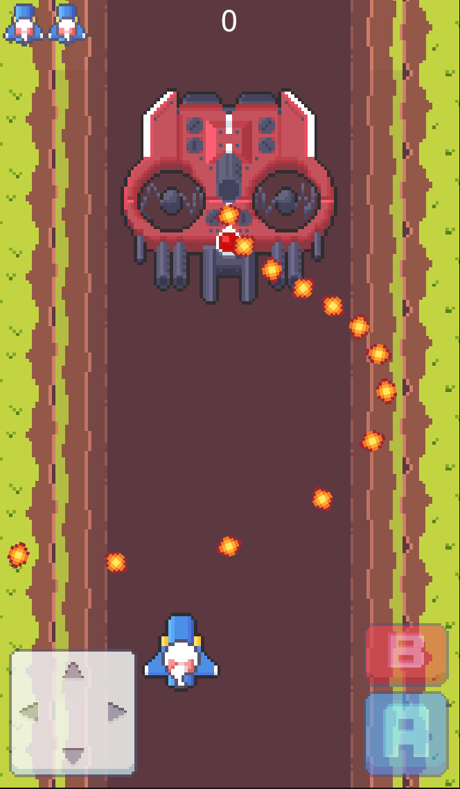
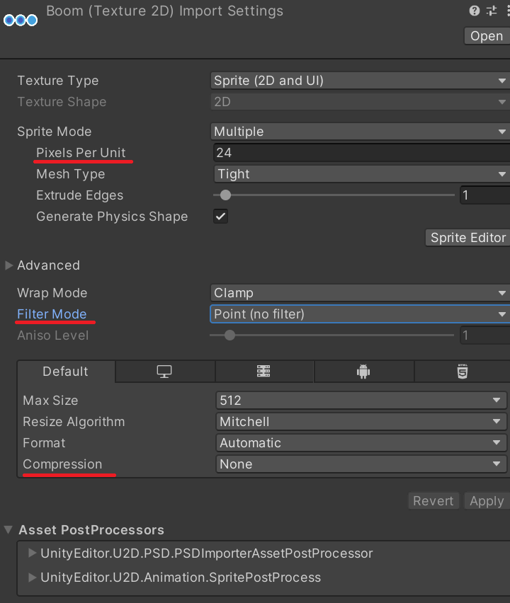
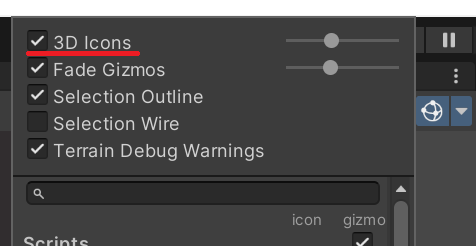
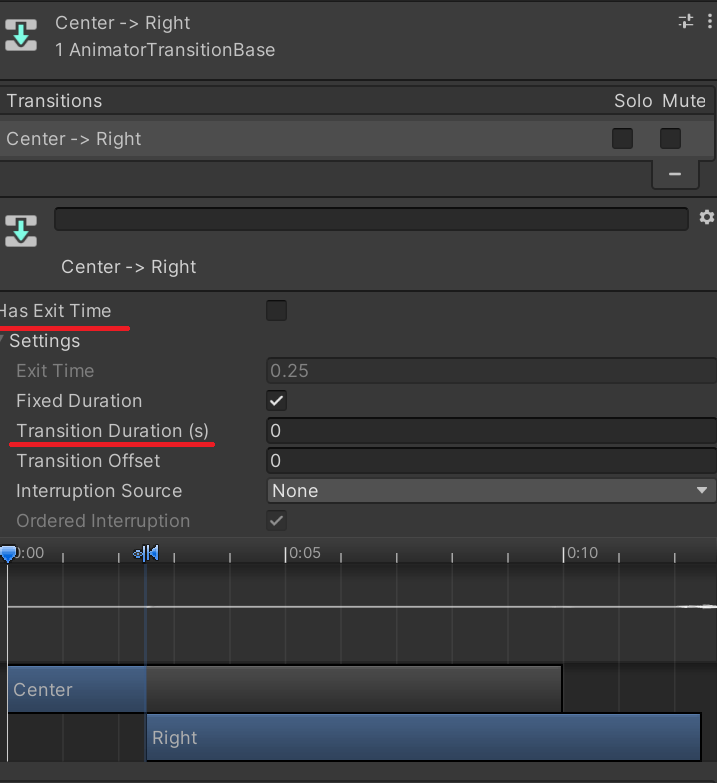
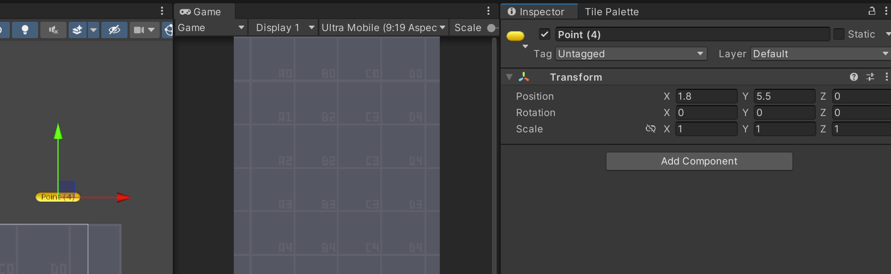
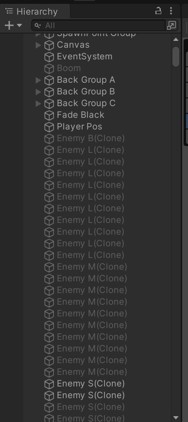

---

layout: single
title: "2D 종스크롤 슈팅"
categories: Unity
tag: [Unity, C#, Study]
toc: true
toc_sticky : true
author_profile: true
search: true

---

# 2D 종스크롤 슈팅게임 만들기





> 골드메탈 유튜버의 2D 종스크롤 슈팅 강좌를 들으면서 모르는 부분은 따로 메모하면서 정리한 문서이니 참고 바랍니다
>
> https://www.youtube.com/watch?v=ETYzjbnLixY&list=PLO-mt5Iu5TeYtWvM9eN-xnwRbyUAMWd3b


## < 플레이어 이동 구현하기 >

```c#
// player.cs

using JetBrains.Annotations;
using System.Collections;
using System.Collections.Generic;
using UnityEngine;

public class Player : MonoBehaviour
{
    // 플레이어 이동 속도
    public float speed;
    // 총알 발사 딜레이
    public float maxShotDelay;
    public float curShotDelay;
    // 총알 파워
    public int power;
    public int maxPower;

    // 필살기 갯수
    public int boom;
    public int maxBoom;

    // 플레이어 목숨
    public int life;
    // 플레이어 점수
    public int score;

    // 4방향 경계에 닿았다는 플래그 변수
    public bool isTouchTop;
    public bool isTouchBottom;
    public bool isTouchRight;
    public bool isTouchLeft;

    // 총알을 저장할 오브젝트 변수
    public GameObject bulletObjA;
    public GameObject bulletObjB;

    // 필살기
    public GameObject boomEffect;

    // 게임 매니저
    public GameManager gameManager;
    public ObjectManager objectManager;

    public bool isHit;
    public bool isBoomTime;

    public GameObject[] followers;
    public bool isRespawnTime;

    Animator anim;
    SpriteRenderer spriteRenderer;

    // 방향 버튼에 대한 불값
    public bool[] joyControl;
    public bool isControl;

    public bool isButtonA;
    public bool isButtonB;

    private void Awake()
    {
        anim = GetComponent<Animator>();
        spriteRenderer = GetComponent<SpriteRenderer>();
    }
    private void OnEnable()
    {
        Unbeatable();
        Invoke("Unbeatable", 3);
    }

    void Unbeatable()
    {
        isRespawnTime = !isRespawnTime;
        if(isRespawnTime) // 무적타임
        {
            isRespawnTime = true;
            spriteRenderer.color = new Color(1, 1, 1, 0.5f);

            for(int index = 0; index< followers.Length; index++)
            {
                followers[index].GetComponent<SpriteRenderer>().color = new Color(1, 1, 1, 0.5f);
            }
        }
        else
        {
            spriteRenderer.color = new Color(1, 1, 1, 1);

            for (int index = 0; index < followers.Length; index++)
            {
                followers[index].GetComponent<SpriteRenderer>().color = new Color(1, 1, 1, 1);
            }
        }
    }

    void Update()
    {
        Move();
        Fire();
        Boom();
        Reload();
    }

    public void ButtonADown()
    {
        isButtonA = true;
    }

    public void ButtonAUp()
    {
        isButtonA = false;
    }

    public void ButtonBDown()
    {
        isButtonB = true;
    }
    void Fire() // 총알 발사 함수
    {
        // if (!Input.GetButton("Fire1"))
        //    return;

        if (!isButtonA)
            return;

        if (curShotDelay < maxShotDelay)
            return;

        switch(power)
        {
            case 1:
                // 총알 생성
                GameObject bullet = objectManager.MakeObj("BulletPlayerA");
                bullet.transform.position = transform.position;

                Rigidbody2D rigid = bullet.GetComponent<Rigidbody2D>();
                // 총알 발사
                rigid.AddForce(Vector2.up * 10, ForceMode2D.Impulse);
                break;
            case 2:
                GameObject bulletR = objectManager.MakeObj("BulletPlayerA");
                bulletR.transform.position = transform.position + Vector3.right * 0.1f;

                GameObject bulletL = objectManager.MakeObj("BulletPlayerA");
                bulletL.transform.position = transform.position + Vector3.left * 0.1f;

                Rigidbody2D rigidR = bulletR.GetComponent<Rigidbody2D>();
                Rigidbody2D rigidL = bulletL.GetComponent<Rigidbody2D>();

                rigidR.AddForce(Vector2.up * 10, ForceMode2D.Impulse);
                rigidL.AddForce(Vector2.up * 10, ForceMode2D.Impulse);
                break;
            case 3:
            case 4:
            case 5:
            case 6:

                GameObject bulletRR = objectManager.MakeObj("BulletPlayerA");
                bulletRR.transform.position = transform.position + Vector3.right * 0.35f;
                GameObject bulletCC = objectManager.MakeObj("BulletPlayerB");
                bulletCC.transform.position = transform.position;
                GameObject bulletLL = objectManager.MakeObj("BulletPlayerA");
                bulletLL.transform.position = transform.position + Vector3.left * 0.35f;

                Rigidbody2D rigidRR = bulletRR.GetComponent<Rigidbody2D>();
                Rigidbody2D rigidCC = bulletCC.GetComponent<Rigidbody2D>();
                Rigidbody2D rigidLL = bulletLL.GetComponent<Rigidbody2D>();

                rigidRR.AddForce(Vector2.up * 10, ForceMode2D.Impulse);
                rigidCC.AddForce(Vector2.up * 10, ForceMode2D.Impulse);
                rigidLL.AddForce(Vector2.up * 10, ForceMode2D.Impulse);
                break;
        }

        // 딜레이 변수 0으로 초기화
        curShotDelay = 0;
    }
    void Boom() // 필살기 발생
    {
        //if (!Input.GetButton("Fire2"))
        //    return;

        if ((!isButtonB))
        {
            return;
        }

        if (isBoomTime)
            return;

        if (boom == 0)
            return;

        boom--;
        isBoomTime = true;
        gameManager.UpdateBoomIcon(boom);


        // 필살기 이펙트 보이게
        boomEffect.SetActive(true);
        Invoke("OffBoomEffect", 4f);

        // 적 삭제
        GameObject[] enemiesL = objectManager.GetPool("EnemyL");
        GameObject[] enemiesM = objectManager.GetPool("EnemyM");
        GameObject[] enemiesS = objectManager.GetPool("EnemyS");

        for (int index = 0; index < enemiesL.Length; index++)
        {
            if (enemiesL[index].activeSelf)
            {
                Enemy enemyLogic = enemiesL[index].GetComponent<Enemy>();
                enemyLogic.OnHit(1000);
            }
        }

        for (int index = 0; index < enemiesM.Length; index++)
        {
            if (enemiesM[index].activeSelf)
            {
                Enemy enemyLogic = enemiesM[index].GetComponent<Enemy>();
                enemyLogic.OnHit(1000);
            }
        }

        for (int index = 0; index < enemiesS.Length; index++)
        {
            if (enemiesS[index].activeSelf)
            {
                Enemy enemyLogic = enemiesS[index].GetComponent<Enemy>();
                enemyLogic.OnHit(1000);
            }
        }

        // 적 총알 삭제
        GameObject[] bulletsA = objectManager.GetPool("BulletEnemyA");
        GameObject[] bulletsB = objectManager.GetPool("BulletEnemyB");

        for (int index = 0; index < bulletsA.Length; index++)
        {
            if (bulletsA[index].activeSelf)
            {
                bulletsA[index].SetActive(false);
            }
        }

        for (int index = 0; index < bulletsB.Length; index++)
        {
            if (bulletsB[index].activeSelf)
            {
                bulletsB[index].SetActive(false);
            }
        }
    }

    void Reload()
    {
        curShotDelay += Time.deltaTime;
    }

    public void JoyPanel(int type)
    {
        for(int index =0; index < 9; index++)
        {
            joyControl[index] = index == type;
        }
    }

    public void JoyDown()
    {
        isControl = true;
    }

    public void JoyUp()
    {
        isControl = false;
    }

    void Move() // 캡슐화, 캐릭터 무브 함수
    {
        // Input.GetAxisRaw()를 통한 방향 값 추출
        float h = Input.GetAxisRaw("Horizontal");
        float v = Input.GetAxisRaw("Vertical");

        if (joyControl[0]) { h = -1; v = 1; }
        if (joyControl[1]) { h = 0; v = 1; }
        if (joyControl[2]) { h = 1; v = 1; }
        if (joyControl[3]) { h = -1; v = 0; }
        if (joyControl[4]) { h = 0; v = 0; }
        if (joyControl[5]) { h = 1; v = 0; }
        if (joyControl[6]) { h = -1; v = -1; }
        if (joyControl[7]) { h = 0; v = -1; }
        if (joyControl[8]) { h = 1; v = -1; }

        // 플래그 변수를 사용하여 경계 이상 넘지 못하도록 값 제한
        if ((isTouchRight && h == 1) || (isTouchLeft && h == -1) || !isControl)
            h = 0;

        if ((isTouchTop && v == 1) || (isTouchBottom && v == -1) || !isControl)
            v = 0;

        // 현재 위치
        Vector3 curPos = transform.position;

        // 다음에 이동해야할 위치, transfrom 이동에는 Time.DeltaTime 꼭 사용하기
        Vector3 nextPos = new Vector3(h, v, 0) * speed * Time.deltaTime;
        transform.position = curPos + nextPos;

        // 에니메이션
        if (Input.GetButtonDown("Horizontal") || Input.GetButtonUp("Horizontal"))
        {
            anim.SetInteger("Input", (int)h);
        }
    }
    private void OnTriggerEnter2D(Collider2D collision)
    {
        // 경계선에 닿았을때 4방향 플래그 변수를 True
        if(collision.gameObject.tag == "Border")
        {
            switch(collision.gameObject.name)
            {
                case "Top":
                    isTouchTop = true;
                    break;
                case "Bottom":
                    isTouchBottom = true;
                    break;
                case "Right":
                    isTouchRight = true;
                    break;
                case "Left":
                    isTouchLeft = true;
                    break;
            }
        }
        else if(collision.gameObject.tag == "Enemy" || collision.gameObject.tag == "EnemyBullet") // 플레이어가 적 총알에 맞았을떄
        {
            if (isRespawnTime)
                return;

            if (isHit)
                return;

            isHit = true;
            life--;
            gameManager.UpdateLifeIcon(life);
            gameManager.CallExplosion(transform.position, "P");

            if (life == 0)
            {
                gameManager.GameOver();
            }
            else
            {
                gameManager.RespawnPlayer();
            }
            gameObject.SetActive(false);
            collision.gameObject.SetActive(false);
        }
        else if(collision.gameObject.tag == "Item")
        {
            Item item = collision.gameObject.GetComponent<Item>();
            switch (item.type)
            {
                case "Coin":
                    score += 1000;
                    break;
                case "Power":
                    if (power == maxPower)
                        score += 500;
                    else
                    {
                        power++;
                        AddFollower();
                    }
                    break;
                case "Boom" :
                    if (boom == maxBoom)
                        score += 500;
                    else
                    {
                        boom++;
                        gameManager.UpdateBoomIcon(boom);
                    }
                    break;
            }
            // 아이템 부딪히면 삭제
            collision.gameObject.SetActive(false);
        }
    }

    void AddFollower()
    {
        if (power == 4)
            followers[0].SetActive(true);
        else if (power == 5)
            followers[1].SetActive(true);
        else if (power == 6)
            followers[2].SetActive(true);
    }

    void OffBoomEffect()
    {
        boomEffect.SetActive(false);
        isBoomTime = false;
    }
    private void OnTriggerExit2D(Collider2D collision)
    {
        // 플래그 변수 4방향에서 나갔을때 false로 변경
        if (collision.gameObject.tag == "Border")
        {
            switch (collision.gameObject.name)
            {
                case "Top":
                    isTouchTop = false;
                    break;
                case "Bottom":
                    isTouchBottom = false;
                    break;
                case "Right":
                    isTouchRight = false;
                    break;
                case "Left":
                    isTouchLeft = false;
                    break;
            }
        }
    }
}

```


### 도트 스프라이트 깨짐 없이 가져오는 법

1. Pixels Per Unit 수치 조정

2. Filter Moder > Point (no filter) 변경

3. Compression > None 변경

   

   


한 시트에 여러가지 애니메이션 스프라이트가 들어있는 경우에는 분리가 필요

Sprite Mode > Multiple로 변경 > Sprite Editor > Slice >  Grid By Cell Size > size를 Pixels Per Unit에 맞게 변경 > Padding(여백) 추가


### Camera Icon 가리는  법

Gizmos 오른쪽 아래 삼각형 >  3D Icons 줄이기




### 해상도 조절 하는법

Game 메뉴바 > + > Type > Aspect Ratio로 변경 > Width, Height 9:16 또는 9:19 변경 ( 모바일 환경 )

Free Aspect : 자유 비율 (카메라 크기 = Game뷰 크기)


### Rigidbody 2D의 BodyType

Player의 BodyType > Kinematic으로 변경

Kinematics : 다른 오브젝트와 부딪히면 밀리거나 돌아가거나 하는 그런 물리적인 효과(Dynamic)를 안받게 한다

보통 Border(경계 오브젝트)는 Rigidbody2D BodyType을 Static(고정)으로 변경한다


transform 이동 + rigidbody + box collider (물리) 충돌은 떨림 현상이 발생한다

-> 해결방법 : 경계물체와 player의 collider가 닿았을때 Input으로 받은 상하좌우 값을 0으로 만들면 해결된다

( OnTrigger 관련 함수를 사용할때는 Box collider의 isTrigger가 활성화 되어야 한다 )


### 2D 애니메이터

2d 애니메이션은 3d 애니메이션과 다르게 즉각적으로 반응이 나타나야 한다

애니메이터에서 transition이 일어날때 아래와 같은 설정을 해주어야한다

1. Has Exit Time를 비활성화

2. Transition Duration 값을 0으로 설정

   


## < 총알 발사 구현 하기 >

### 프리펩 

재활용을 위해 에셋으로 저장된 게임 오브젝트

Scene 오브젝트를 에셋 안으로 드래그하여 프리펩을 생성할수 있다

Tips) 프리펩의 transform은 항상 0,0,0으로 저장해놓기

보통 구현하고 싶은 적을 씬에서 컴포넌트를 추가하고, 스크립트를 작성해 구현하고 프리펩의 형태로 나중에 등장시킬수 있도록 저장해놓는다


복사한 프리펩은 이름을 바로 바꿀수 없다 -> Open Prefab 기능으로는 수정이 가능하다!


주의) 프리펩은 이미 Scene에 올라온 오브젝트에 접근이 불가능하다 

-> 총알(프리펩)이 Player(Scene에 비치)를 오브젝트로 가져올수 없기 때문에 이는 GameManager를 통해 해결할수 있다

(적 생성 직후에 플레이어 변수를 넘겨주는 것으로 해결)

프리펩이 프리펩 사용은 가능하다


### 오브젝트 생성 , 파괴 함수

오브젝트를 파괴하는 함수 : Destory()

오브젝트를 생성하는 함수 Instantiate(); //  매개변수로 프리펩과, 위치 방향이 들어간다 


## < 적 비행기 만들기 >

```c#
// Enemy.cs

using System.Collections;
using System.Collections.Generic;
using System.Runtime.Serialization;
using UnityEngine;
using UnityEngine.UIElements;

public class Enemy : MonoBehaviour
{

    // 적이 가지고 있는 점수
    public int enemyScore;

    // 적 이름
    public string enemyName; 

    public float speed;
    public int health;
    // 변경할 스프라이트 배열
    public Sprite[] sprites;

    // 스프라이트 바꿀려면 SpriteRenderer 필요
    SpriteRenderer spriteRenderer;

    // 총알 발사 딜레이
    public float maxShotDelay;
    public float curShotDelay;

    // 적 총알 오브젝트
    public GameObject bulletObjA;
    public GameObject bulletObjB;

    // 아이템
    public GameObject itemCoin;
    public GameObject itemPower;
    public GameObject itemBoom;

    public GameObject player;
    public ObjectManager objectManager;
    public GameManager gameManager;

    // 보스 에니메이터
    Animator anim;

    public int patternIndex;
    public int curPatternCount;
    public int[] maxPatternCount;


    private void Awake()
    {
        spriteRenderer = GetComponent<SpriteRenderer>();

        if(enemyName == "B")
        {
            anim = GetComponent<Animator>();
        }

    }

    private void OnEnable()
    {
        switch(enemyName)
        {
            case "B":
                health = 3000;
                Invoke("Stop",2);
                break;
            case "L":
                health = 40;
                break;
            case "M":
                health = 10;
                break;
            case "S":
                health = 3;
                break;
        }
    }

    void Update()
    {
        if (enemyName == "B")
            return;
        Fire();
        Reload();
    }


    void Stop()
    {
        if (!gameObject.activeSelf)
            return;

        Rigidbody2D rigid = GetComponent<Rigidbody2D>();
        rigid.velocity = Vector2.zero;

        Invoke("Think", 2);
    }

    void Think()
    {
        patternIndex = patternIndex == 3 ? 0 : patternIndex + 1;
        // 패턴 변경시, 패턴 실행 횟수 변수 초기화
        curPatternCount = 0;

        switch(patternIndex)
        {
            case 0:
                FireFoward();
                break;
            case 1:
                FireShot();
                break;
            case 2:
                FireArc();
                break;
            case 3:
                FireAround();
                break;
        }
    }

    void FireFoward()
    {

        if (health <= 0)
            return;
        Debug.Log("앞으로 4발 발사");

        GameObject bulletR = objectManager.MakeObj("BulletBossA");
        bulletR.transform.position = transform.position + Vector3.right * 0.3f;

        GameObject bulletRR = objectManager.MakeObj("BulletBossA");
        bulletRR.transform.position = transform.position + Vector3.right * 0.45f;

        GameObject bulletL = objectManager.MakeObj("BulletBossA");
        bulletL.transform.position = transform.position + Vector3.left * 0.3f;

        GameObject bulletLL = objectManager.MakeObj("BulletBossA");
        bulletLL.transform.position = transform.position + Vector3.left * 0.45f;


        Rigidbody2D rigidR = bulletR.GetComponent<Rigidbody2D>();
        Rigidbody2D rigidL = bulletL.GetComponent<Rigidbody2D>();
        Rigidbody2D rigidRR = bulletRR.GetComponent<Rigidbody2D>();
        Rigidbody2D rigidLL = bulletLL.GetComponent<Rigidbody2D>();

        // 총알 발사
        rigidR.AddForce(Vector2.down * 8, ForceMode2D.Impulse);
        rigidRR.AddForce(Vector2.down * 8, ForceMode2D.Impulse);
        rigidL.AddForce(Vector2.down * 8, ForceMode2D.Impulse);
        rigidLL.AddForce(Vector2.down * 8, ForceMode2D.Impulse);

        curPatternCount++;

        if (curPatternCount < maxPatternCount[patternIndex])
            Invoke("FireFoward", 2);
        else
            Invoke("Think", 2);
    }

    void FireShot()
    {
        if (health <= 0)
            return;

        for (int index = 0; index < 5; index++)
        {
            GameObject bullet = objectManager.MakeObj("BulletEnemyB");
            bullet.transform.position = transform.position;

            Rigidbody2D rigid = bullet.GetComponent<Rigidbody2D>();

            Vector2 dirVec = player.transform.position - transform.position;
            Vector2 ranVec = new Vector2(Random.Range(-0.5f,0.5f), Random.Range(0f, 2f));
            dirVec += ranVec;
            // 총알 발사
            rigid.AddForce(dirVec.normalized * 3, ForceMode2D.Impulse);
        }

        curPatternCount++;

        if (curPatternCount < maxPatternCount[patternIndex])
            Invoke("FireShot", 2);
        else
            Invoke("Think", 2);
    }

    void FireArc()
    {
        if (health <= 0)
            return;

        GameObject bullet = objectManager.MakeObj("BulletEnemyA");
        bullet.transform.position = transform.position;
        bullet.transform.rotation = Quaternion.identity;

        Rigidbody2D rigid = bullet.GetComponent<Rigidbody2D>();

        Vector2 dirVec = new Vector2(Mathf.Cos(Mathf.PI * 10 * curPatternCount / maxPatternCount[patternIndex]), -1);
        rigid.AddForce(dirVec.normalized * 3, ForceMode2D.Impulse);

        curPatternCount++;

        if (curPatternCount < maxPatternCount[patternIndex])
            Invoke("FireArc", 0.15f);
        else
            Invoke("Think", 3);
    }

    void FireAround()
    {
        if (health <= 0)
            return;

        int roundNumA = 50;
        int roundNumB = 40;
        int roundNum = curPatternCount % 2 == 0 ? roundNumA : roundNumB;

        for(int index = 0; index < roundNum; index++)
        {
            GameObject bullet = objectManager.MakeObj("BulletBossB");
            bullet.transform.position = transform.position;
            bullet.transform.rotation = Quaternion.identity;

            Rigidbody2D rigid = bullet.GetComponent<Rigidbody2D>();

            Vector2 dirVec = new Vector2(Mathf.Cos(Mathf.PI * 2 * index / roundNum), Mathf.Sin(Mathf.PI * 2 * index / roundNum));
            rigid.AddForce(dirVec.normalized * 3, ForceMode2D.Impulse);

            Vector3 rotVec = Vector3.forward * 360 * index / roundNum + Vector3.forward*90;
            bullet.transform.Rotate(rotVec);
        }

        curPatternCount++;

        if (curPatternCount < maxPatternCount[patternIndex])
            Invoke("FireAround", 0.7f);
        else
            Invoke("Think", 3);
    }

    void Fire() // 총알 발사 함수
    {
        if (curShotDelay < maxShotDelay)
            return;

        if (enemyName == "S")
        {
            // 총알 생성
            GameObject bullet = objectManager.MakeObj("BulletEnemyA");
            bullet.transform.position = transform.position;

            Rigidbody2D rigid = bullet.GetComponent<Rigidbody2D>();

            Vector3 dirVec = player.transform.position - transform.position;
            // 총알 발사
            rigid.AddForce(dirVec.normalized * 6, ForceMode2D.Impulse);
        }
        else if(enemyName == "L")
        {
            // 총알 생성
            GameObject bulletR = objectManager.MakeObj("BulletEnemyB");
            bulletR.transform.position = transform.position + Vector3.right * 0.3f;

            GameObject bulletL = objectManager.MakeObj("BulletEnemyB");
            bulletL.transform.position = transform.position + Vector3.left * 0.3f;

            Rigidbody2D rigidR = bulletR.GetComponent<Rigidbody2D>();
            Rigidbody2D rigidL = bulletL.GetComponent<Rigidbody2D>();

            Vector3 dirVecR = player.transform.position - (transform.position + Vector3.right * 0.3f);
            Vector3 dirVecL = player.transform.position - (transform.position + Vector3.left * 0.3f);

            // 총알 발사
            rigidR.AddForce(dirVecR.normalized * 6, ForceMode2D.Impulse);
            rigidL.AddForce(dirVecL.normalized * 6, ForceMode2D.Impulse);
        }
        // 딜레이 변수 0으로 초기화
        curShotDelay = 0;
    }

    void Reload()
    {
        curShotDelay += Time.deltaTime;
    }

    public void OnHit(int dmg) // 데미지 받는 함수
    {
        if (health <= 0)
            return;

        health -= dmg;

        if(enemyName == "B")
        {
            anim.SetTrigger("OnHit");
        }
        else
        {
            // 데미지 효과 적용
            spriteRenderer.sprite = sprites[1];
            Invoke("ReturnSprite", 0.1f);
        }

        if(health <= 0)
        {
            // 플레이어에게 점수 넘기기
            Player playerLogic = player.GetComponent<Player>();
            playerLogic.score += enemyScore;

            // 적 죽으면 아이템 드랍
            int ran = enemyName == "B" ? 0 : Random.Range(0, 10);
            if(ran < 3)
            {
                Debug.Log("Not Item");
            }
            else if (ran < 6) // coin
            {
                GameObject itemCoin = objectManager.MakeObj("ItemCoin");
                itemCoin.transform.position = transform.position;
            }
            else if (ran < 8) // Power
            {
                GameObject itemPower = objectManager.MakeObj("ItemPower");
                itemPower.transform.position = transform.position;
            }
            else if (ran < 10) // Boom
            {
                GameObject itemBoom = objectManager.MakeObj("ItemBoom");
                itemBoom.transform.position = transform.position;
            }

            gameObject.SetActive(false);
            CancelInvoke();
            transform.rotation = Quaternion.identity;
            gameManager.CallExplosion(transform.position, enemyName);

            if (enemyName == "B")
                gameManager.StageEnd();
        }
    }

    void ReturnSprite()
    {
        spriteRenderer.sprite = sprites[0];
    }

    private void OnTriggerEnter2D(Collider2D collision)
    {
        if(collision.gameObject.tag == "BorderBullet" && enemyName != "B") // 화면 밖으로 나가면 소멸
        {
            gameObject.SetActive(false);
            transform.rotation = Quaternion.identity;
        }
        else if(collision.gameObject.tag == "PlayerBullet") // 총알 피격
        {
            Bullet bullet = collision.gameObject.GetComponent<Bullet>();
            OnHit(bullet.dmg);

            // 플레이어의 총알 소멸
            collision.gameObject.SetActive(false);
        }
    }
}

```


### Polygon collider 2D

polygon collider 2D 모양의 크기는 Physics Shape 모양 그대로 따라간다

Sprite Editor > Custom Physics Shape(물리 콜라이더 모양을 마음대로 정할수 있다) > 모양 재정의 후 Apply

모양을 조정했는데도 콜라이더가 안바뀌어있으면 polygon collider 2D의 Rest 버튼 누르기


Tips ) collider의 is trigger는 오브젝트 간의 물리적 충돌을 제거하고 싶을 경우에도 활성화를 시킨다


### Rigidbody

속력 필요할때는 rigidbody 컴포넌트를 추가해 사용하자

rigidbody 에 있는 velocity에 접근 가능하기 때문이다


### Random 

Random.Range() 함수는 매개변수에 의해 반환 타입이 결정된다

float 타입이 들어가면 반환값도 float, int형이 들어가면 반환값도 int 형이다


### EmptyObject  위치  표시하는  법

이름명 수정하는곳 옆에 있는 정육면체 모양을 눌러서 아래와 같이 다른 모양으로 바꾸면

EmptyObject여도 Scene에서는 어디에 위치하는지 확인할수 있다




## < 적 전투와 피격 이벤트 만들기 >

```c++
// bullet.cs
using System.Collections;
using System.Collections.Generic;
using UnityEngine;

public class Bullet : MonoBehaviour
{
    public int dmg; // 총알 데미지
    public bool isRotate;

    private void Update()
    {
        if (isRotate)
            transform.Rotate(Vector3.forward * 10);
    }
    private void OnTriggerEnter2D(Collider2D collision)
    {
        if(collision.gameObject.tag == "BorderBullet")
        {
            gameObject.SetActive(false);
        }
    }
}

```
### Rotate

2d 게임에서는 회전을 사용할때 무조건 Z축만 사용한다

나머지 축은 쓸 필요가 없다

Z축은 Vector.front 아니면 Vectorback 단위벡터를 사용한다


### SetActive(false)

오브젝트를 비활성화 하는 함수이다

오브젝트가 비활성화 된 후에 Invoke 함수를 쓰려고 하면 비활성화 이미 됐기 때문에 Invoke 함수는 쓸수 없다

-> 이런 경우에는 GameManager 씬에 비치된 게임관리 오브젝트를 활용해서 플레이어를 복귀 시키는 방안으로 해결 가능하다


## < UI 간단하게 완성하기 >


```c#
// GameManager.cs

using System.Collections;
using System.Collections.Generic;
using UnityEngine;
using UnityEngine.UI;
using UnityEngine.SceneManagement;
using System.IO;
using TMPro;

public class GameManager : MonoBehaviour
{
    public int stage;
    public Animator stageAnim;
    public Animator clearAnim;
    public Animator fadeAnim;
    public Transform playerPos;

    // 적 오브젝트 배열
    public string[] enemyObjs;
    // 적 소환할 위치 배열 ( 5개의 점 )
    public Transform[] spawnPoints;

    public float nextSpawnDelay;
    public float curSpawnDelay;

    public GameObject player;

    // 스코어
    public Text scoreText;
    public Image[] lifeImage;
    public Image[] boomImage;
    public GameObject gameOverSet;
    public ObjectManager objectManager;

    // 적 출현 관련된 변수
    public List<Spawn> spawnList;
    public int spawnIndex;
    public bool spawnEnd;
    private void Awake()
    {
        spawnList = new List<Spawn>();
        enemyObjs = new string[] { "EnemyS", "EnemyM", "EnemyL","EnemyB" };
        StageStart();
    }

    public void StageStart()
    {
        // UI Load
        stageAnim.SetTrigger("On");
        stageAnim.GetComponent<Text>().text = "Stage " + stage + "\nSTART!";
        clearAnim.GetComponent<Text>().text = "Stage " + stage + "\nClEAR!";

        // 적 스폰 파일 읽기
        ReadSpawnFile();


        // Fade In
        fadeAnim.SetTrigger("In");
    }

    public void StageEnd()
    {
        // Clear UI Load
        clearAnim.SetTrigger("On");

        // Fade Out
        fadeAnim.SetTrigger("Out");

        // Player Repos
        player.transform.position = playerPos.position;

        stage++;

        if (stage > 2)
            GameOver();
        else
            Invoke("StageStart", 5);
    }

    void ReadSpawnFile()
    {
        // 변수 초기화
        spawnList.Clear();
        spawnIndex = 0;
        spawnEnd = false;

        // 리스폰 파일 읽기
        TextAsset textFile = Resources.Load("Stage " + stage) as TextAsset;
        StringReader stringReader = new StringReader(textFile.text);

        while(stringReader != null)
        {
            string line = stringReader.ReadLine();

            Debug.Log(line);

            if (line == null)
                break;

            Spawn spawnData = new Spawn();
            spawnData.delay = float.Parse(line.Split(',')[0]);
            spawnData.type = line.Split(',')[1];
            spawnData.point = int.Parse(line.Split(',')[2]);
            spawnList.Add(spawnData);
        }

        // 텍스트 파일 닫기
        stringReader.Close();

        nextSpawnDelay = spawnList[0].delay;
    }

    private void Update()
    {
        // 현재 흐르고 있는 시간
        curSpawnDelay += Time.deltaTime;

        // 스폰할 시간이 지나면
        if(curSpawnDelay > nextSpawnDelay && !spawnEnd)
        {
            SpawnEnemy();
            curSpawnDelay = 0;
        }

        // UI 업데이트
        Player playerLogic = player.GetComponent<Player>();
        scoreText.text = string.Format("{0:n0}",playerLogic.score);
    }

    public void CallExplosion(Vector3 pos, string type)
    {
        GameObject explosion = objectManager.MakeObj("Explosion");
        Explosion explosionLogic = explosion.GetComponent<Explosion>();

        explosion.transform.position = pos;
        explosionLogic.StartExplosion(type);
    }
    void SpawnEnemy()
    {
        int enemyIndex = 0;

        switch(spawnList[spawnIndex].type)
        {
            case "S":
                enemyIndex = 0;
                break;
            case "M":
                enemyIndex = 1;
                break;
            case "L":
                enemyIndex = 2;
                break;
            case "B":
                enemyIndex = 3;
                break;
        }

        int enemyPoint = spawnList[spawnIndex].point;

        GameObject enemy = objectManager.MakeObj(enemyObjs[enemyIndex]);
        enemy.transform.position = spawnPoints[enemyPoint].position;

        Rigidbody2D rigid = enemy.GetComponent<Rigidbody2D>();
        Enemy enemyLogic = enemy.GetComponent<Enemy>();
        enemyLogic.player = player;
        enemyLogic.gameManager = this;
        enemyLogic.objectManager = objectManager;

        if (enemyPoint == 5 || enemyPoint == 6) // 오른쪽에서 왼쪽으로 가는 적 움직임 구현
        {
            enemy.transform.Rotate(Vector3.back * 90);
            rigid.velocity = new Vector2(enemyLogic.speed * (-1), -1);
        }
        else if (enemyPoint == 7 || enemyPoint == 8) // 왼쪽에서 오른쪽
        {
            enemy.transform.Rotate(Vector3.forward * 90);
            rigid.velocity = new Vector2(enemyLogic.speed, -1);
        }
        else
            rigid.velocity = new Vector2(0, enemyLogic.speed * (-1)); // 위에서 아래로

        // 리스폰 인덱스 증가
        spawnIndex++;
        if(spawnIndex == spawnList.Count)
        {
            spawnEnd = true;
            return;
        }

        // 다음 리스폰 딜레이 갱신
        nextSpawnDelay = spawnList[spawnIndex].delay;

    }

    public void UpdateLifeIcon(int life)
    {
        for (int index = 0; index < 3; index++)
        {
            lifeImage[index].color = new Color(1, 1, 1, 0);
        }

        for (int index = 0; index<life; index++)
        {
            lifeImage[index].color = new Color(1, 1, 1, 1);
        }
    }

    public void UpdateBoomIcon(int boom)
    {
        for (int index = 0; index < 3; index++)
        {
            boomImage[index].color = new Color(1, 1, 1, 0);
        }

        for (int index = 0; index < boom; index++)
        {
            boomImage[index].color = new Color(1, 1, 1, 1);
        }
    }

    public void RespawnPlayer()
    {
        Invoke("RespawnPlayerExe", 2f);
    }
    public void RespawnPlayerExe()
    {
        player.transform.position = Vector3.down * 3.5f;
        player.SetActive(true);

        Player playerLogic = player.GetComponent<Player>();
        playerLogic.isHit = false;
    }

    public void GameOver()
    {
        gameOverSet.SetActive(true);
    }

    public void GameRestart()
    {
        SceneManager.LoadScene(0);
    }
 }

```
### Canvas Scaler

UI Scale Mode > Constant Pixel Size(픽셀 고정)을 Scale With Screen Size로 변경

Scale With Screen Size : 기준 해상도 UI 크기 유지


Button 배경 이미지는 Border 설정 필요하다


### string.format() 

지정된 양식으로 문자열을 반환해주는 함수

{0:n0} : 세자리마다 쉼표로 나눠주는 숫자 양식


### using UnityEngine.SceneManagement

scene 관리할때는  using UnityEngine.SceneManagement;를 꼭 선언해주어야한다

SceneManager.LoadScene(0); 씬 불러오는 함수이다

숫자로 불러 오려면 Bulid Settings에서 해당 씬이 올라가져 있어야 한다

없다면 Add Open Scenes를 눌러 씬을 추가하자


## < 아이템과 필살기 구현하기 >

```c#
// item.cs

using System.Collections;
using System.Collections.Generic;
using UnityEngine;

public class Item : MonoBehaviour
{
    // 아이템 타입을 위한 변수 추가
    public string type;
    Rigidbody2D rigid;

    private void Awake()
    {
        rigid = GetComponent<Rigidbody2D>();
    }

    private void OnEnable()
    {
        rigid.velocity = Vector2.down * 1.5f;
    }
}
```

### FindGameObjectsWithTag() 함수

태그로 장면의 모든 오브젝트를 추출하는 함수


## <무한 배경 만들기 >

배경을 3개 늘어 붙여서 밑 스프라이트가 카메라 영역을 벗어나면 다시 위로 올라가는 방식으로 구현

Camera View 높이 = Camera Size * 2


## Position

Position은 글로벌 기준 좌표이고, LocalPosition은 로컬 기준 좌표이다


## orthographicSize

orthographic 카메라 Size를 의미한다


## 스크롤링 기법

```c#
using System.Collections;
using System.Collections.Generic;
using UnityEngine;

public class Background : MonoBehaviour
{
    public float speed;
    public int startIndex;
    public int endIndex;
    public Transform[] sprites;

    float viewHeight;

    private void Awake()
    {
        viewHeight = Camera.main.orthographicSize*2;
    }
    void Update()
    {
        // 배경 밑으로 움직임
        Vector3 curPos = transform.position;
        Vector3 nextPos = Vector3.down * speed * Time.deltaTime;
        transform.position = curPos + nextPos;


        // 끝까지 도달했으면 위로 다시 재생
        if (sprites[endIndex].position.y < viewHeight*(-1))
        {
            Vector3 backSpritePos = sprites[startIndex].localPosition;
            Vector3 frontSpritePos = sprites[endIndex].localPosition;
            sprites[endIndex].transform.localPosition = backSpritePos + Vector3.up * viewHeight;

            int startIndexSave = startIndex;
            startIndex = endIndex;
            endIndex = (startIndexSave-1 == -1) ? sprites.Length-1 : startIndexSave - 1;
        }
    }
}

```


## Parallax 기법

거리에 따른 상대적 속도를 활용한 기술이다

멀리있는건 늦게, 가까이 있는건 빠르게 속도를 조절하면 입체적으로 보인다

( 플랫포머에서 주로 사용된다 )


## < 최적화의 기본, 오브젝트 풀링 >


```c#
// ObjectManager.cs

using System.CodeDom.Compiler;
using System.Collections;
using System.Collections.Generic;
using UnityEngine;

public class ObjectManager : MonoBehaviour
{
    public GameObject enemyLPrefab;
    public GameObject enemyMPrefab;
    public GameObject enemySPrefab;
    public GameObject itemCoinPrefab;
    public GameObject itemPowerPrefab;
    public GameObject itemBoomPrefab;
    public GameObject bulletPlayerAPrefab;
    public GameObject bulletPlayerBPrefab;
    public GameObject bulletEnemyAPrefab;
    public GameObject bulletEnemyBPrefab;
    public GameObject bulletFollowerPrefab;
    public GameObject bulletBossAPrefab;
    public GameObject bulletBossBPrefab;
    public GameObject enemyBPrefab;
    public GameObject explosionPrefab;

    GameObject[] enemyL;
    GameObject[] enemyM;
    GameObject[] enemyS;

    GameObject[] itemCoin;
    GameObject[] itemPower;
    GameObject[] itemBoom;

    GameObject[] bulletPlayerA;
    GameObject[] bulletPlayerB;
    GameObject[] bulletEnemyA;
    GameObject[] bulletEnemyB;
    GameObject[] bulletFollower;

    GameObject[] bulletBossA;
    GameObject[] bulletBossB;

    GameObject[] targetPool;
    GameObject[] enemyB;

    GameObject[] explosion;

    void Awake()
    {
        enemyB = new GameObject[1];
        enemyL = new GameObject[10];
        enemyM = new GameObject[10];
        enemyS = new GameObject[20];

        itemCoin = new GameObject[20];
        itemPower = new GameObject[10];
        itemBoom = new GameObject[10];

        bulletPlayerA = new GameObject[100];
        bulletPlayerB = new GameObject[100];
        bulletEnemyA = new GameObject[100];
        bulletEnemyB = new GameObject[100];
        bulletFollower = new GameObject[100];

        bulletBossA = new GameObject[50];
        bulletBossB = new GameObject[1000];

        explosion = new GameObject[20];


        Generate();
    }

    void Generate()
    {
        for (int index = 0; index < enemyB.Length; index++)
        {
            enemyB[index] = Instantiate(enemyBPrefab);
            enemyB[index].SetActive(false);
        }

        // enemy
        for (int index = 0; index < enemyL.Length; index++)
        {
            enemyL[index] = Instantiate(enemyLPrefab);
            enemyL[index].SetActive(false);
        }


        for (int index = 0; index < enemyM.Length; index++)
        {
            enemyM[index] = Instantiate(enemyMPrefab);
            enemyM[index].SetActive(false);
        }

        for (int index = 0; index < enemyS.Length; index++)
        {
            enemyS[index] = Instantiate(enemySPrefab);
            enemyS[index].SetActive(false);
        }

        // item
        for (int index = 0; index < itemCoin.Length; index++)
        {
            itemCoin[index] = Instantiate(itemCoinPrefab);
            itemCoin[index].SetActive(false);
        }

        for (int index = 0; index < itemPower.Length; index++)
        {
            itemPower[index] = Instantiate(itemPowerPrefab);
            itemPower[index].SetActive(false);
        }

        for (int index = 0; index < itemBoom.Length; index++)
        {
            itemBoom[index] = Instantiate(itemBoomPrefab);
            itemBoom[index].SetActive(false);
        }

        // bullet
        for (int index = 0; index < bulletPlayerA.Length; index++)
        {
            bulletPlayerA[index] = Instantiate(bulletPlayerAPrefab);
            bulletPlayerA[index].SetActive(false);
        }

        for (int index = 0; index < bulletPlayerB.Length; index++)
        {
            bulletPlayerB[index] = Instantiate(bulletPlayerBPrefab);
            bulletPlayerB[index].SetActive(false);
        }

        for (int index = 0; index < bulletEnemyA.Length; index++)
        {
            bulletEnemyA[index] = Instantiate(bulletEnemyAPrefab);
            bulletEnemyA[index].SetActive(false);
        }

        for (int index = 0; index < bulletEnemyB.Length; index++)
        {
            bulletEnemyB[index] = Instantiate(bulletEnemyBPrefab);
            bulletEnemyB[index].SetActive(false);
        }

        for (int index = 0; index < bulletFollower.Length; index++)
        {
            bulletFollower[index] = Instantiate(bulletFollowerPrefab);
            bulletFollower[index].SetActive(false);
        }

        for (int index = 0; index < bulletBossA.Length; index++)
        {
            bulletBossA[index] = Instantiate(bulletBossAPrefab);
            bulletBossA[index].SetActive(false);
        }

        for (int index = 0; index < bulletBossB.Length; index++)
        {
            bulletBossB[index] = Instantiate(bulletBossBPrefab);
            bulletBossB[index].SetActive(false);
        }

        for (int index = 0; index <explosion.Length; index++)
        {
            explosion[index] = Instantiate(explosionPrefab);
            explosion[index].SetActive(false);
        }
    }

    // 오브젝트 풀에 접근할수 있는 함수 생성
    public GameObject MakeObj(string type)
    {
        switch (type)
        {
            case "EnemyL":
                targetPool = enemyL;
                break;
            case "EnemyM":
                targetPool = enemyM;
                break;
            case "EnemyS":
                targetPool = enemyS;
                break;
            case "ItemCoin":
                targetPool = itemCoin;
                break;
            case "ItemPower":
                targetPool = itemPower;
                break;
            case "ItemBoom":
                targetPool = itemBoom;
                break;
            case "BulletPlayerA":
                targetPool = bulletPlayerA;
                break;
            case "BulletPlayerB":
                targetPool = bulletPlayerB;
                break;
            case "BulletEnemyA":
                targetPool = bulletEnemyA;
                break;
            case "BulletEnemyB":
                targetPool = bulletEnemyB;
                break;
            case "bulletFollower":
                targetPool = bulletFollower;
                break;
            case "BulletBossA":
                targetPool = bulletBossA;
                break;
            case "BulletBossB":
                targetPool = bulletBossB;
                break;
            case "EnemyB":
                targetPool = enemyB;
                break;
            case "Explosion":
                targetPool = explosion;
                break;
        }

        for (int index = 0; index < targetPool.Length; index++)
        {
            if (!targetPool[index].activeSelf)
            {
                targetPool[index].SetActive(true);
                return targetPool[index];
            }
        }

        return null;
    }

    public GameObject[] GetPool(string type)
    {
        switch (type)
        {
            case "EnemyL":
                targetPool = enemyL;
                break;
            case "EnemyM":
                targetPool = enemyM;
                break;
            case "EnemyS":
                targetPool = enemyS;
                break;
            case "ItemCoin":
                targetPool = itemCoin;
                break;
            case "ItemPower":
                targetPool = itemPower;
                break;
            case "ItemBoom":
                targetPool = itemBoom;
                break;
            case "BulletPlayerA":
                targetPool = bulletPlayerA;
                break;
            case "BulletPlayerB":
                targetPool = bulletPlayerB;
                break;
            case "BulletEnemyA":
                targetPool = bulletEnemyA;
                break;
            case "BulletEnemyB":
                targetPool = bulletEnemyB;
                break;
            case "BulletFollower":
                targetPool = bulletFollower;
                break;
            case "BulletBossA":
                targetPool = bulletBossA;
                break;
            case "BulletBossB":
                targetPool = bulletBossB;
                break;
            case "EnemyB":
                targetPool = enemyB;
                break;
            case "Explosion":
                targetPool = explosion;
                break;
        }

        return targetPool;
    }
}

```


### 오브젝트 풀링

Instantiate, Destroy(생성, 삭제) 함수 같은 경우에는 쓰레기 메모리가 계속 쌓인다

-> 쓰레기 메모리가 쌓인 만큼 가비지컬렉트(GC) 가 실행될때 렉이 심하게 걸린다

이를 해결하는 기술이 오브젝트 풀링이라고 한다

 오브젝트 풀링 : 미리 생성해둔 풀에서 활성화/비활성화로 사용




첫 로딩시간 = 장면배치 + 오브젝트 풀 생성


### 가비지컬렉트(GC)

가비지컬렉트(GC) : 쌓인 조각난 메모리를 비우는 기술

가비지컬렉트를 피하기 위해 오브젝트 풀링 기술이 필수적이다


### OnEnable()

컴포넌트가 활성화 될때 호출되는 생명주기함수


## < 텍스트 파일을 이용한 커스텀 배치 구현 >

텍스트 파일을 이용해서 몬스터 등장을 더 효율적으로 다룰수 있다

```c#
 // GameManager에 있던 텍스트 파일 읽기 코드를 따로 뽑아온 코드입니다

 // 적 출현 관련된 변수
 public List<Spawn> spawnList;
 public int spawnIndex;
 public bool spawnEnd;

 void ReadSpawnFile()
 {
     // 변수 초기화
     spawnList.Clear();
     spawnIndex = 0;
     spawnEnd = false;

     // 리스폰 파일 읽기
     TextAsset textFile = Resources.Load("Stage " + stage) as TextAsset;
     StringReader stringReader = new StringReader(textFile.text);

     while(stringReader != null)
     {
         string line = stringReader.ReadLine();

         Debug.Log(line);

         if (line == null)
             break;

         Spawn spawnData = new Spawn();
         spawnData.delay = float.Parse(line.Split(',')[0]);
         spawnData.type = line.Split(',')[1];
         spawnData.point = int.Parse(line.Split(',')[2]);
         spawnList.Add(spawnData);
     }

     // 텍스트 파일 닫기
     stringReader.Close();

     nextSpawnDelay = spawnList[0].delay;
 }
```


```c#
// spawn 구조체

using System.Collections;
using System.Collections.Generic;
using UnityEngine;

public class Spawn
{
    public float delay;
    public string type;
    public int point;
}
```


### using System.IO

파일 읽기를 위한 라이브러리 


### as

C#에서 as 연산자는 보통 캐스팅을 할 때 사용되는 문법이다

캐스팅에 성공하면 캐스트 결과를 반환하고, 캐스팅에 실패하면 null 값을 반환한다


### TextAsset

텍스트 데이터를 저장하고 로드하는데 사용되는 데이터 유형이다

TextAsset textFile = Resources.Load("Stage 0");

Resurces.Load("Stage 0") 의 의미 : Resources 폴더 내에 있는 Stage 0 이라는 파일을 불러오는 함수


### StringReader

파일 내의 문자열 데이터 읽기 클래스

StringReader로 열어둔 파일은 작업이 끝난 후 꼭 닫아야한다


### ReadLine()

텍스트 데이터를 한줄씩 반환 ( 자동 줄 바꿈 )


## < 따라다니는 보조무기 만들기 >

```c++
// follow.cs

using System.Collections;
using System.Collections.Generic;
using System.Runtime.Serialization;
using Unity.VisualScripting;
using UnityEngine;

public class Follower : MonoBehaviour
{
    // 총알 발사 딜레이
    public float maxShotDelay;
    public float curShotDelay;

    public ObjectManager objectManager;

    public Vector3 followPos;
    public int followDelay;
    public Transform parent;
    public Queue<Vector3> parentPos;

    private void Awake()
    {
        parentPos = new Queue<Vector3>();
    }
    void Update()
    {
        Watch();
        Follow();
        Fire();
        Reload();
    }

    void Watch()
    {
        if(!parentPos.Contains(parent.position))
        parentPos.Enqueue(parent.position);

        if (parentPos.Count > followDelay)
            followPos = parentPos.Dequeue();
        else if (parentPos.Count < followDelay)
            followPos = parent.position;
    }

    void Follow()
    {
        transform.position = followPos;
    }

    void Fire() // 총알 발사 함수
    {
        if (!Input.GetButton("Fire1"))
            return;

        if (curShotDelay < maxShotDelay)
            return;

        GameObject bullet = objectManager.MakeObj("BulletFollower");
        bullet.transform.position = transform.position;

        Rigidbody2D rigid = bullet.GetComponent<Rigidbody2D>();
        rigid.AddForce(Vector2.up * 10, ForceMode2D.Impulse);

        // 딜레이 변수 0으로 초기화
        curShotDelay = 0;
    }
    
    void Reload()
    {
        curShotDelay += Time.deltaTime;
    }

}
```


### Queue

먼저 입력된 데이터가 먼저 나가는 자료구조 (FIFO)

Enqueue() : 큐에 데이터 저장하는 함수

Dequeue() : 큐에 첫 데이터를 빼면서 반환하는 함수


## < 보스 만들기 >

### 보스 패턴 구현하기

```c++
// 보스 패턴 또한 enemy.cs에 있기 때문에 enemy 스크립트에서 해당 부분만 코드를 가져왔다

private void OnEnable()
{
    switch(enemyName)
    {
        case "B": // B는 보스를 의미
            health = 3000;
            Invoke("Stop",2);
            break;
        case "L":
            health = 40;
            break;
        case "M":
            health = 10;
            break;
        case "S":
            health = 3;
            break;
    }
}

void Update()
{
    if (enemyName == "B")
        return;
    Fire();
    Reload();
}


void Stop()
{
    if (!gameObject.activeSelf)
        return;

    Rigidbody2D rigid = GetComponent<Rigidbody2D>();
    rigid.velocity = Vector2.zero;

    Invoke("Think", 2);
}

void Think()
{
    patternIndex = patternIndex == 3 ? 0 : patternIndex + 1;
    // 패턴 변경시, 패턴 실행 횟수 변수 초기화
    curPatternCount = 0;

    switch(patternIndex)
    {
        case 0:
            FireFoward();
            break;
        case 1:
            FireShot();
            break;
        case 2:
            FireArc();
            break;
        case 3:
            FireAround();
            break;
    }
}

void FireFoward()
{

    if (health <= 0)
        return;
    Debug.Log("앞으로 4발 발사");

    GameObject bulletR = objectManager.MakeObj("BulletBossA");
    bulletR.transform.position = transform.position + Vector3.right * 0.3f;

    GameObject bulletRR = objectManager.MakeObj("BulletBossA");
    bulletRR.transform.position = transform.position + Vector3.right * 0.45f;

    GameObject bulletL = objectManager.MakeObj("BulletBossA");
    bulletL.transform.position = transform.position + Vector3.left * 0.3f;

    GameObject bulletLL = objectManager.MakeObj("BulletBossA");
    bulletLL.transform.position = transform.position + Vector3.left * 0.45f;


    Rigidbody2D rigidR = bulletR.GetComponent<Rigidbody2D>();
    Rigidbody2D rigidL = bulletL.GetComponent<Rigidbody2D>();
    Rigidbody2D rigidRR = bulletRR.GetComponent<Rigidbody2D>();
    Rigidbody2D rigidLL = bulletLL.GetComponent<Rigidbody2D>();

    // 총알 발사
    rigidR.AddForce(Vector2.down * 8, ForceMode2D.Impulse);
    rigidRR.AddForce(Vector2.down * 8, ForceMode2D.Impulse);
    rigidL.AddForce(Vector2.down * 8, ForceMode2D.Impulse);
    rigidLL.AddForce(Vector2.down * 8, ForceMode2D.Impulse);

    curPatternCount++;

    if (curPatternCount < maxPatternCount[patternIndex])
        Invoke("FireFoward", 2);
    else
        Invoke("Think", 2);
}

void FireShot()
{
    if (health <= 0)
        return;

    for (int index = 0; index < 5; index++)
    {
        GameObject bullet = objectManager.MakeObj("BulletEnemyB");
        bullet.transform.position = transform.position;

        Rigidbody2D rigid = bullet.GetComponent<Rigidbody2D>();

        Vector2 dirVec = player.transform.position - transform.position;
        Vector2 ranVec = new Vector2(Random.Range(-0.5f,0.5f), Random.Range(0f, 2f));
        dirVec += ranVec;
        // 총알 발사
        rigid.AddForce(dirVec.normalized * 3, ForceMode2D.Impulse);
    }

    curPatternCount++;

    if (curPatternCount < maxPatternCount[patternIndex])
        Invoke("FireShot", 2);
    else
        Invoke("Think", 2);
}

void FireArc()
{
    if (health <= 0)
        return;

    GameObject bullet = objectManager.MakeObj("BulletEnemyA");
    bullet.transform.position = transform.position;
    bullet.transform.rotation = Quaternion.identity;

    Rigidbody2D rigid = bullet.GetComponent<Rigidbody2D>();

    Vector2 dirVec = new Vector2(Mathf.Cos(Mathf.PI * 10 * curPatternCount / maxPatternCount[patternIndex]), -1);
    rigid.AddForce(dirVec.normalized * 3, ForceMode2D.Impulse);

    curPatternCount++;

    if (curPatternCount < maxPatternCount[patternIndex])
        Invoke("FireArc", 0.15f);
    else
        Invoke("Think", 3);
}

void FireAround()
{
    if (health <= 0)
        return;

    int roundNumA = 50;
    int roundNumB = 40;
    int roundNum = curPatternCount % 2 == 0 ? roundNumA : roundNumB;

    for(int index = 0; index < roundNum; index++)
    {
        GameObject bullet = objectManager.MakeObj("BulletBossB");
        bullet.transform.position = transform.position;
        bullet.transform.rotation = Quaternion.identity;

        Rigidbody2D rigid = bullet.GetComponent<Rigidbody2D>();

        Vector2 dirVec = new Vector2(Mathf.Cos(Mathf.PI * 2 * index / roundNum), Mathf.Sin(Mathf.PI * 2 * index / roundNum));
        rigid.AddForce(dirVec.normalized * 3, ForceMode2D.Impulse);

        Vector3 rotVec = Vector3.forward * 360 * index / roundNum + Vector3.forward*90;
        bullet.transform.Rotate(rotVec);
    }

    curPatternCount++;

    if (curPatternCount < maxPatternCount[patternIndex])
        Invoke("FireAround", 0.7f);
    else
        Invoke("Think", 3);
}
```


## < 마무리 >

### this

클래스 자신을 일컫는 키워드 이다


### Canvas

Render Mode > Screen Space - Overaly : 게임과 UI를 따로 보고 싶을떄 사용

Render Mode > Screen Space - Camera : 게임과 UI를 함께 보고 싶을때 사용


### Orientation

Default Orientation -> Portrait 변경 ( 무조건 세로로만 된다 )

Package Name 안드로이드 경로 com.회사이름.어플이름 작성


### Scripting Backend

구글플레이에 어플을 등록하면 무조건 스크립트 타입을 IL2CPP로 변경해야한다


### ARMv7, ARM64

체크하여 64비트로 빌드를 설정해야한다
