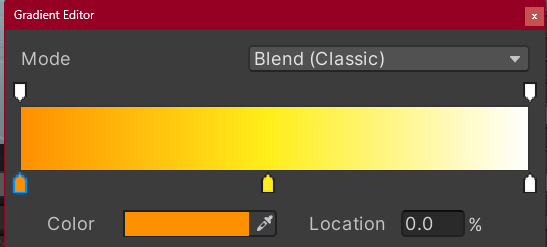

---

layout: single
title: "3D 쿼터뷰 액션게임"
categories: Unity
tag: [Unity, C#, Study]
toc: true
toc_sticky : true
author_profile: true
search: true

---

# 3D 쿼터뷰 액션게임


## < 플레이어 이동 >

```c#
// player.cs
using System.Collections;
using System.Collections.Generic;
using UnityEditor;
using UnityEngine;

public class Player : MonoBehaviour
{
    public float speed;
    float hAxis;
    float vAxis;
    bool wDown; // shift (걷기) 버튼 누름 유무

    Vector3 moveVec;

    Animator anim;

    void Start()
    {
        anim = GetComponentInChildren<Animator>();
    }

    // Update is called once per frame
    void Update()
    {
        hAxis = Input.GetAxisRaw("Horizontal");
        vAxis = Input.GetAxisRaw("Vertical");
        wDown = Input.GetButton("Walk");

        // 대각선 이동은 피타고라스 정리에 의해 루트2므로 normalized를 사용하기
        moveVec = new Vector3(hAxis, 0, vAxis).normalized;

        // 걷는다면 속도를 낮추기
        transform.position += moveVec * speed * (wDown ? 0.3f : 1f) * Time.deltaTime;

        anim.SetBool("isRun", moveVec != Vector3.zero);
        anim.SetBool("isWalk", wDown);

        // 캐릭터 회전 ( 나아가는 방향으로 바라보기 )
        transform.LookAt(transform.position + moveVec);
    }
}
```


### Mesh Renderer

Mesh를 눈에 보여주는 역할을 하는 컴포넌트이다


### transform 물리충돌 무시 해결방법

transform은 update에서 이루어지고, 물리 충돌(ex 벽)은 fixedUpdate에서 이루어지기 때문에 프레임 차이로 인해서 무시하는 경우가 발생한다

해결방법 : player의 rigidbody 에서 Collision Detection을 Continuous로 변경 ( 빠르게 움직이는 콜라이더가 서로 통과하지 않도록 하는 기능 )


### .FBX

각종 정보들이 구분되어 저장되는 3D 포멧을 의미한다


### GetComponentInChildren<>

자식 객체 중 특정 컴포넌트를 추출하는 기능을 가지고 있다


### LookAt()

지정된 벡터를 향해서 회전시켜주는 함수


### 쿼터뷰

화면이 고정되어 있는 상태에서 캐릭터와 사물들이 위아래로 쳐다보는 3인칭 시점을 의미한다

쿼터뷰는 맵 지형물이 보통 y축을 기준으로 45도로 기울어져 있어서 대각선으로 움직이도록 표현한다


## < 카메라 플레이어에 부착 >

```c#
// Follow.cs
using System.Collections;
using System.Collections.Generic;
using UnityEngine;

public class Follow : MonoBehaviour
{
    public Transform target;
    public Vector3 offset;
    void Update()
    {
        transform.position = target.position + offset; // 카메라가 따라다니는 위치
    }
}
```


## < 점프와 회피 >

```c#
// playe.cs +추가) 움직임 구현 함수로 정리 및 점프 회피 구현

using System.Collections;
using System.Collections.Generic;
using UnityEditor;
using UnityEngine;

public class Player : MonoBehaviour
{
    public float speed;
    float hAxis;
    float vAxis;
    bool wDown; // shift (걷기) 버튼 누름 유무
    bool jDown; // Jump 버튼 누름 유무

    bool isJump; // 점프 중인지의 유무
    bool isDodge; // 회피 ( 점프키 ) 버튼 누름 유무

    Vector3 moveVec;
    Vector3 dodgeVec; // 회피할때 방향 고정하는 벡터

    Animator anim;

    Rigidbody rigid;

    void Start()
    {
        anim = GetComponentInChildren<Animator>();
        rigid = GetComponent<Rigidbody>();
    }

    // Update is called once per frame
    void Update()
    {
        GetInput();
        Move();
        Turn();
        Jump();
        Dodge();
    }

    void GetInput() // 키보드 입력(움직임)을 받는 함수
    {
        hAxis = Input.GetAxisRaw("Horizontal");
        vAxis = Input.GetAxisRaw("Vertical");
        wDown = Input.GetButton("Walk");
        jDown = Input.GetButtonDown("Jump");
    }

    void Move() // 캐릭터 이동 함수
    {
        // 대각선 이동은 피타고라스 정리에 의해 루트2므로 normalized를 사용하기
        moveVec = new Vector3(hAxis, 0, vAxis).normalized;

        if (isDodge) // 회피할때 방향고정
        {
            moveVec = dodgeVec;
        }

        // 걷는다면 속도를 낮추기
        transform.position += moveVec * speed * (wDown ? 0.3f : 1f) * Time.deltaTime;

        anim.SetBool("isRun", moveVec != Vector3.zero);
        anim.SetBool("isWalk", wDown);
    }

    void Turn() // 캐릭터 회전 함수 ( 나아가는 방향으로 바라보기 )
    {
        transform.LookAt(transform.position + moveVec);
    }

    void Jump() // 캐릭터 점프 함수
    {
        if(jDown && moveVec == Vector3.zero && !isJump && !isDodge)
        {
            rigid.AddForce(Vector3.up * 15, ForceMode.Impulse);
            anim.SetBool("isJump", true);
            anim.SetTrigger("doJump");
            isJump = true;
        }
    }
    void Dodge() // 캐릭터 회피 함수
    {
        if (jDown && moveVec != Vector3.zero && !isJump && !isDodge)
        {
            dodgeVec = moveVec;
            speed *= 2;
            anim.SetTrigger("doDodge");
            isDodge = true;

            Invoke("DodgeOut", 0.5f);
        }
    }

    void DodgeOut() // 일정시간이 지나면 회피 체크 false로 전환하는 함수
    {
        isDodge = false;
        speed *= 0.5f;
    }

    private void OnCollisionEnter(Collision collision)
    {
        if(collision.gameObject.tag == "Floor") // 플레이어가 바닥에 닿으면 점프 초기화
        {
            anim.SetBool("isJump", false);
            isJump = false;
        }
    }
}
```


### 지형 물리 강화


1) Collision Detection을 Continuous로 변경했을때는 Static과 충돌할 때 효과적이다

   Static은 오른쪽 위 체크박스를 체크하면 설정할수 있다

2) 지형 오브젝트에 Rigidbody 컴포넌트 추가하기

3) 마찰력이 없는 벽을 만들기 위해 Physics Material 추가하기


## < 아이템 만들기 >

```c#
using System.Collections;
using System.Collections.Generic;
using UnityEngine;

public class Item : MonoBehaviour
{
    public enum Type { Ammo, Coin, Grenade, Heart, Weapon};
    public Type type;
    public int value;

    private void Update()
    {
        transform.Rotate(Vector3.up * 20 * Time.deltaTime);
    }
}
```

밑에 이펙트 컴포넌트들은 empty Object를 따로 만들어서 컴포넌트로 추가해주었다

### Light 컴포넌트

Intensity : 빛의 세기

Range : 빛의 범위

Color : 빛의 색상


### 빛이 여러개일때 화면에 따라 빛이 꺼지는 현상 

Scene에서 사용할 수 있는 라이트가 제한되어 있어서 생기는 현상이다

Edit - Project Settings - Quality - Pixel Light Count 에서 숫자를 올려주면 해결이 가능하다


### Particle System 컴포넌트

색상이 자홍색이라면 재질을 못찾았다는 의미이다

-> Renderer에서 Material를 찾아서 연결하기

Emission : 파티클 입자 출력양

Shape : 파티클 입자 출력 모양

Start LifeTime : 입자 생존 시간

오른쪽 역삼각형을 누르면 Random Between Two Constants로 랜덤하게 입자가 나올수 있도록 변환이 가능하다

Start Speed : 입자 시작 속도


Color Over Life Time : 시간에 따른 색상 변화



아래 표시줄은 색상을 결정하고 위의 표시줄은 알파값을 조정한다


Size Over LifeTime : 시간에 따른 크기 변화


Rate of Distance : 파티클의 위치 변화에 따라 입자 생성


Limit Velocity over LifeTime : 시간에 따른 속도제한

Drag : 저항값


### Enum

열거형 타입 ( 타입 이름 지정 필요 )

enum 선언은 중괄호 안에 데이터를 열거하듯이 작성


## <  드랍 무기 입수와 교체 >

```c#
// player.cs +추가) 무기 상호작용 + 스왑

using System.Collections;
using System.Collections.Generic;
using UnityEditor;
using UnityEngine;

public class Player : MonoBehaviour
{
    public float speed;
    public GameObject[] weapons;
    public bool[] hasWeapons; // 플레이어 무기관련 배열 

    float hAxis;
    float vAxis;
    bool wDown; // shift (걷기) 버튼 누름 유무
    bool jDown; // Jump 버튼 누름 유무
    bool iDown; // 아이템과 상호작용 키

    bool isJump; // 점프 중인지의 유무
    bool isDodge; // 회피 ( 점프키 ) 버튼 누름 유무
    bool isSwap;

    bool sDown1; // 무기 스왑 버튼
    bool sDown2;
    bool sDown3;

    Vector3 moveVec;
    Vector3 dodgeVec; // 회피할때 방향 고정하는 벡터

    Animator anim;
    Rigidbody rigid;

    GameObject nearObject; // 트리거 된 아이템을 저장하기 위한 변수
    GameObject equipWeapon; // 기존에 장착된 무기를 저장하는 변수
    int equipWeaponIndex = -1; // 들고 있는 무기 인덱스

    void Start()
    {
        anim = GetComponentInChildren<Animator>();
        rigid = GetComponent<Rigidbody>();
    }

    // Update is called once per frame
    void Update()
    {
        GetInput();
        Move();
        Turn();
        Jump();
        Dodge();
        Swap();
        Interation();
    }

    void GetInput() // 키보드 입력(움직임)을 받는 함수
    {
        hAxis = Input.GetAxisRaw("Horizontal");
        vAxis = Input.GetAxisRaw("Vertical");
        wDown = Input.GetButton("Walk");
        jDown = Input.GetButtonDown("Jump");
        iDown = Input.GetButtonDown("Interation");
        sDown1 = Input.GetButtonDown("Swap1");
        sDown2 = Input.GetButtonDown("Swap2");
        sDown3 = Input.GetButtonDown("Swap3");
    }

    void Move() // 캐릭터 이동 함수
    {
        // 대각선 이동은 피타고라스 정리에 의해 루트2므로 normalized를 사용하기
        moveVec = new Vector3(hAxis, 0, vAxis).normalized;

        if (isDodge) // 회피할때 방향고정
        {
            moveVec = dodgeVec;
        }

        if(isSwap)
        {
            moveVec = Vector3.zero;
        }

        // 걷는다면 속도를 낮추기
        transform.position += moveVec * speed * (wDown ? 0.3f : 1f) * Time.deltaTime;

        anim.SetBool("isRun", moveVec != Vector3.zero);
        anim.SetBool("isWalk", wDown);
    }


    void Swap()
    {
        // 무기가 없을때, 같은 무기 고를때 못고르게 하는 로직
        if (sDown1 && (!hasWeapons[0] || equipWeaponIndex == 0))
            return;

        if (sDown2 && (!hasWeapons[1] || equipWeaponIndex == 1))
            return;

        if (sDown3 && (!hasWeapons[2] || equipWeaponIndex == 2))
            return;

        int weaponIndex = -1;
        if (sDown1) weaponIndex = 0;
        if(sDown2) weaponIndex = 1;
        if (sDown3) weaponIndex = 2;

        if((sDown1 || sDown2 || sDown3) && !isJump && !isDodge)
        {
            if(equipWeapon != null)
                equipWeapon.SetActive(false);

            equipWeaponIndex = weaponIndex;
            equipWeapon = weapons[weaponIndex];
            equipWeapon.SetActive(true);

            anim.SetTrigger("doSwap");
            isSwap = true;

            Invoke("SwapOut", 0.4f);
        }
    }

    void SwapOut()
    {
        isSwap = false;
    }
    
    void Interation()
    {
        if(iDown && nearObject != null && !isJump && !isDodge) // 무기 줏어먹기
        {
            if(nearObject.tag == "Weapon")
            {
                Item item = nearObject.GetComponent<Item>();
                int weaponIndex = item.value;
                hasWeapons[weaponIndex] = true;

                Destroy(nearObject);
            }
        }
    }

    void OnTriggerStay(Collider other)
    {
        if (other.gameObject.tag == "Weapon")
            nearObject = other.gameObject;

        Debug.Log(nearObject);
    }

    void OnTriggerExit(Collider other)
    {
        if (other.gameObject.tag == "Weapon")
            nearObject = null;
    }
}
```


## < 아이템 먹기 & 공전물체 만들기 >

```c#
// player.cs +추가) 아이템 먹기 구현
public class Player : MonoBehaviour
{
   	public int ammo; // 탄약
    public int coin; // 코인
    public int health; // 체력
    public int hasGrenades; // 수류탄

    public int maxAmmo; // 탄약 최대값
    public int maxCoin; // 코인 최대값
    public int maxHealth; // 체력 최대값
    public int maxHasGrenade; // 수류탄 최대값
    
    private void OnTriggerEnter(Collider other)
    {
        if(other.tag == "Item") // 아이템 입수
        {
            Item item = other.GetComponent<Item>();
            switch (item.type)
            {
                case Item.Type.Ammo:
                    ammo += item.value;
                    if (ammo > maxAmmo)
                        ammo = maxAmmo;
                    break;
                case Item.Type.Coin:
                    coin += item.value;
                    if (coin > maxCoin)
                        coin = maxCoin;
                    break;
                case Item.Type.Heart:
                    health += item.value;
                    if (health > maxHealth)
                        health = maxHealth;
                    break;
                case Item.Type.Grenade:
                    grenades[hasGrenades].SetActive(true);
                    hasGrenades += item.value;
                    if (hasGrenades > maxHasGrenade)
                        hasGrenades = maxHasGrenade;
                    break;
            }
            Destroy(other.gameObject);
        }
    }
}
```


```c#
// orbit.cs 공전 물체 만들기 구현
using System.Collections;
using System.Collections.Generic;
using UnityEngine;

public class Orbit : MonoBehaviour
{
    public Transform target; // 공전 목표
    public float orbitSpeed; // 공전 속도
    Vector3 offSet; // 목표와의 거리

    void Start()
    {
        offSet = transform.position - target.position;    
    }
    void Update()
    {
        transform.position = target.position + offSet;
        transform.RotateAround(target.position, Vector3.up, orbitSpeed * Time.deltaTime);
        offSet = transform.position - target.position;
    }
}
```


### RotateAround()

타겟 주위를 회전하는 함수

목표가 움직이면 일그러지는 단점이 존재한다


## 


## < 코루틴으로 근접공격 구현하기 >

```c#
// player +추가) Attack 함수 구현
void Attack()
    {
        if (equipWeapon == null)
            return;

        fireDelay += Time.deltaTime;
        isFireReady = equipWeapon.rate < fireDelay;

        if(fDown && isFireReady && !isDodge && !isSwap)
        {
            equipWeapon.Use();
            anim.SetTrigger("doSwing");
            fireDelay = 0;
        }
    }
```


```c#
// Weapon.cs
using System.Collections;
using System.Collections.Generic;
using UnityEngine;

public class Weapon : MonoBehaviour
{
    public enum Type { Melee, Range} // 공격타입
    public Type type;
    public int damage; // 데미지
    public float rate; // 공속
    public BoxCollider meleeArea; // 범위
    public TrailRenderer trailEffect; // 효과

    public void Use()
    {
        if(type == Type.Melee)
        {
            StopCoroutine("Swing");
            StartCoroutine("Swing");
        }
    }
    IEnumerator Swing()
    {
        yield return new WaitForSeconds(0.3f);
        meleeArea.enabled = true;
        trailEffect.enabled = true;

        yield return new WaitForSeconds(0.3f);
        meleeArea.enabled = false;

        yield return new WaitForSeconds(0.3f);
        trailEffect.enabled = false;

    }

}
```


### Trail Renderer

잔상을 그려주는 컴포넌트

Time : 잔상의 시간을 설정

Min Vertex Distance : 잔상 꺾임을 설정 ( 값이 클수록 각진 모양이 나옴 )

Color : 잔상 색상을 설정


### 코루틴

보통의 함수는 Use() 메인루틴 -> Swing() 서브 루틴 함수 호출 -> Use() 메인루틴 이런 방식으로 이루어지지만

코루틴은 Use() 메인루틴 + Swing() 코루틴 (Co-Op) 동시에  이루어진다

즉 코루틴 함수 : 메인루틴 + 코루틴 (동시 실행)


Update문이 아닌곳에서도 간혹 반복적으로 코드가 실행되어야 할 필요가 있을때 코루틴을 사용하는것이 효과적이다

또한 코루틴은 필요한 순간에만 반복하고, 필요하지 않을때는 사용하지 않을수 있기 때문에 자원관리를 매우 효과적으로 해준다


일정시간만큼 지연시키는 Invoke와 동일한 기능을 가지고 있지만, 코루틴은 매개변수를 넘길수도 있는 장점이 있다


#### 코루틴 사용방법

```c#
    public void Use()
    {
        if(type == Type.Melee)
        {
            StopCoroutine("Swing");
            StartCoroutine("Swing");
        }
    }

	IEnumerator Swing()
    {
        // 1번 실행
        yield return null; // 1 프레임 대기
        // 2번 실행
        yield return new WaitForSeconds(0.3f); // 0.3초 대기
        // 3번 실행

        yield break; // 코루틴 탈출
    }
```

#### IEnumerator 

열거형 함수 클래스, 코루틴은 IEnumerator라는 반환형으로 시작되어야 한다


#### yield 

결과를 전달하는 키워드 ( 코루틴 함수는 1개 이상 yield 필요 )

yield 키워드를 여러개 사용하여 시간차 로직 작성이 가능하다


#### yield break

코루틴 탈출


#### StartCoroutine()

코루틴 실행하는 함수


#### StopCoroutine()

코루틴 정지 함수


# < 원거리 공격 구현>

```c#
   	// Weapon.cs +추가) 원거리 공격 구현
    IEnumerator Shot()
    {
        // 1. 총알 발사
        GameObject intantBullet = Instantiate(bullet, bulletPos.position, bulletPos.rotation);
        Rigidbody bulletRigid = intantBullet.GetComponent<Rigidbody>();
        bulletRigid.velocity = bulletPos.forward * 50;

        yield return null;
        // 2. 탄피 배출
        GameObject intantCase = Instantiate(bulletCase, bulletCasePos.position, bulletCasePos.rotation);
        Rigidbody caseRigid = intantCase.GetComponent<Rigidbody>();
        Vector3 caseVec = bulletCasePos.forward * Random.Range(-3, -2) + Vector3.up * Random.Range(2, 3);
        caseRigid.AddForce(caseVec,ForceMode.Impulse);
        caseRigid.AddTorque(Vector3.up * 10, ForceMode.Impulse);
    }
```

```c#
// Bullet.cs 총알 벽이나 바닥에 닿으면 Destroy 
using System.Collections;
using System.Collections.Generic;
using UnityEngine;

public class Bullet : MonoBehaviour
{
    public int damage;

    private void OnCollisionEnter(Collision collision)
    {
        if(collision.gameObject.tag == "Floor") // 탄피
        {
            Destroy(gameObject, 3);
        }
        else if (collision.gameObject.tag == "Wall") // 총알
        {
            Destroy(gameObject);
        }
    }
}
```

```c#
    // player.cs +추가) 원거리 무기 재장전하는 함수 구현
    void Attack()
    {
        if (equipWeapon == null)
            return;

        fireDelay += Time.deltaTime;
        isFireReady = equipWeapon.rate < fireDelay;

        if(fDown && isFireReady && !isDodge && !isSwap)
        {
            equipWeapon.Use();
            anim.SetTrigger(equipWeapon.type == Weapon.Type.Melee ? "doSwing" : "doShot");
            fireDelay = 0;
        }
    }

    void Reload()
    {
        if (equipWeapon == null) return;
        if (equipWeapon.type == Weapon.Type.Melee) return;
        if (ammo == 0) return;

        if (rDown && !isJump && !isDodge && !isSwap && isFireReady)
        {
            anim.SetTrigger("doReload");
            isReload = true;
            Invoke("ReloadOut", 3f);
        }
}
    void ReloadOut()
    {
        int reAmmo = ammo < equipWeapon.maxAmmo ? ammo : equipWeapon.maxAmmo;
        equipWeapon.curAmmo = equipWeapon.maxAmmo;
        ammo -= reAmmo;
        isReload = false;
    }
```


## < 원거리 공격시 캐릭터 방향 회전 >

```c#
void Turn() // 캐릭터 회전 함수 ( 나아가는 방향으로 바라보기 )
{
    // 키보드에 의한 회전
    transform.LookAt(transform.position + moveVec);

    // 마우스에 의한 회전
    if(fDown) // 공격 키 입력
    {
        Ray ray = followCamera.ScreenPointToRay(Input.mousePosition);
        RaycastHit rayHit;
        if (Physics.Raycast(ray, out rayHit, 100))
        {
            Vector3 nextVec = rayHit.point - transform.position;
            nextVec.y = 0;
            transform.LookAt(transform.position + nextVec);
        }
    }
}
```


### Physics.Raycast

시작 지점에서 특정 방향으로 씬의 모든 충돌체를 상대하는 광선을 투사


### ScreenPointToRay() 

스크린에서 월드로 Ray를 쏘는 함수


### out

return처럼 반환값을 주어진 변수에 저장하는 키워드


## < 물리 문제 고치기 > 

### 자동 회전 방지

외부 충돌에 의해 리지드바디 회전 속력이 생김

```c#
    void FreezeRotation()
    {
        rigid.angularVelocity = Vector3.zero;
    }

    private void FixedUpdate()
    {
        FreezeRotation();    
    }
```

#### AngularVelocity

물리회전속도 


## 총알, 탄피, 플레이어 겹치지 않게 하는법

Layer를 각각 설정해서 Project Setting에서 Layer Collision Matrix를 관리하면 된다


## 벽 관통 방지

레이케스트를 통해 광선이 벽에 닿으면 bool 값을 받아 Move 함수를 관리

```c#
    void Move() // 캐릭터 이동 함수
    {
        // 대각선 이동은 피타고라스 정리에 의해 루트2므로 normalized를 사용하기
        moveVec = new Vector3(hAxis, 0, vAxis).normalized;

        if (isDodge) // 회피할때 방향고정
        {
            moveVec = dodgeVec;
        }

        if(isSwap || isReload ||!isFireReady)
        {
            moveVec = Vector3.zero;
        }

        if(!isBorder)
            transform.position += moveVec * speed * (wDown ? 0.3f : 1f) * Time.deltaTime;

        anim.SetBool("isRun", moveVec != Vector3.zero);
        anim.SetBool("isWalk", wDown);
    }
    
    private void FixedUpdate()
    {
        FreezeRotation();
        StopToWall();
    }

    void StopToWall()
    {
        Debug.DrawRay(transform.position, transform.forward * 5, Color.green);
        isBorder = Physics.Raycast(transform.position, transform.forward, 5, LayerMask.GetMask("Wall"));
    }
```


### Material

Material은 Mesh Renderer 컴포넌트에서 접근이 가능하다 

```c#
public class Enemy : MonoBehaviour
{
    Material mat;

    private void Awake()
    {
        mat = GetComponent<MeshRenderer>().material;
    }
}
```

## 


## < 수류탄 구현하기 >

```c#
// Grenade.cs 수류탄이 터지는 코드
using System.Collections;
using System.Collections.Generic;
using UnityEngine;

public class Grenade : MonoBehaviour
{
    public GameObject meshObj;
    public GameObject effectObj;
    public Rigidbody rigid;

    // 수류탄 폭파
    private void Start()
    {
        StartCoroutine(Explosion());
    }

    IEnumerator Explosion()
    {
        yield return new WaitForSeconds(3f);
        rigid.velocity = Vector3.zero;
        rigid.angularVelocity = Vector3.zero;
        meshObj.SetActive(false);
        effectObj.SetActive(true);

        // 수류탄 피격 (부피가 있는 레이케스트)
        RaycastHit[] rayHits = Physics.SphereCastAll(transform.position, 15, Vector3.up, 0f, LayerMask.GetMask("Enemy"));

        foreach(RaycastHit hitObj in rayHits)
        {
            hitObj.transform.GetComponent<Enemy>().HitByGrenade(transform.position);
        }

        Destroy(gameObject, 5);
    }
}
```


### Physics.SphereCastAll

레이캐스트를 구의 모양으로 진행하는 함수, 여러 오브젝트를 반환하기 때문에 RaycastHit[] 배열을 사용해야한다


```c#
// player.cs +추가) 수류탄을 앞으로 던지는 코드    
private void Grenade()
    {
        if (hasGrenades == 0)
            return;

        if(gDown && !isReload && !isSwap)
        {
            Ray ray = followCamera.ScreenPointToRay(Input.mousePosition);
            RaycastHit rayHit;
            if (Physics.Raycast(ray, out rayHit, 100))
            {
                Vector3 nextVec = rayHit.point - transform.position;
                nextVec.y = 10;

                GameObject instantGrenade = Instantiate(grenadeObj, transform.position, transform.rotation);
                Rigidbody rigidGrenade = instantGrenade.GetComponent<Rigidbody>();
                rigidGrenade.AddForce(nextVec, ForceMode.Impulse);
                rigidGrenade.AddTorque(Vector3.back * 10, ForceMode.Impulse);

                hasGrenades--;
                grenades[hasGrenades].SetActive(false);
            }
        }
    }
```

```c#
    // enemy.cs +추가) 적이 수류탄에 맞으면 피격 효과 추가
    public void HitByGrenade(Vector3 explosionPos)
    {
        curHealth -= 100;
        Vector3 reactVec = transform.position - explosionPos;
        StartCoroutine(OnDamage(reactVec, true));
    }

    IEnumerator OnDamage(Vector3 reactVec, bool isGrenade)
    {
        mat.color = Color.red;

        yield return new WaitForSeconds(0.1f);

        if(curHealth > 0)
        {
            mat.color = Color.white;
        }
        else
        {
            mat.color = Color.gray;
            gameObject.layer = 12;

            if(isGrenade)
            {
                reactVec = reactVec.normalized;
                reactVec += Vector3.up * 3;
                rigid.freezeRotation = false;
                rigid.AddForce(reactVec * 5, ForceMode.Impulse);
                rigid.AddTorque(reactVec * 15, ForceMode.Impulse);

            }
            else
            {
                reactVec = reactVec.normalized;
                reactVec += Vector3.up;
                rigid.AddForce(reactVec * 5, ForceMode.Impulse);
            }

            Destroy(gameObject, 4);
        }
    }
```


## < 목표를 추적하는 AI 만들기 >

```c#
// enemy.cs
public class Enemy : MonoBehaviour
{
    public int maxHealth;
    public int curHealth;
    public Transform target;
    public bool isChase; // 추적을 결정하는 변수

    Rigidbody rigid;
    BoxCollider boxCollider;
    Material mat;
    NavMeshAgent nav;
    Animator anim;

    private void Awake()
    {
        rigid = GetComponent<Rigidbody>();
        boxCollider = GetComponent<BoxCollider>();
        mat = GetComponentInChildren<MeshRenderer>().material;
        nav = GetComponent<NavMeshAgent>();
        anim = GetComponentInChildren<Animator>();

        Invoke("ChaseStart", 2);
    }

    void ChaseStart()
    {
        isChase = true;
        anim.SetBool("isWalk", true);
    }
    private void Update()
    {
        if(isChase)
            nav.SetDestination(target.position);
    }

    private void FixedUpdate()
    {
        FreezeVelocity();
    }
    void FreezeVelocity()
    {
        if(isChase)
        {
            rigid.velocity = Vector3.zero;
            rigid.angularVelocity = Vector3.zero;
        }
    }
}
```


### Nav Mesh Agent

Navigation을 사용하는 인공지능 컴포넌트

( 컴포넌트 추가에 안뜨면 Package Manager에서 AI install 하기 )

NavAgent를 사용하기 위해선 NavMesh가 필요하다


### using UnityEngine.AI 

스크립트에서 Nav 관련 클래스를 사용할땐 using UnityEngine.AI 네임 스페이스 사용


### SetDestination()

도착할 목표 위치 지정 함수


### NavMesh

NavAgent가 경로를 그리기 위한 바탕 ( Mesh )

window > AI > Navigation


Nvigation 창에서 NavMesh를 Bake로 생성하면 NavMesh가 생성된다

**NavMesh는 Static 오브젝트만 Bake 가능하다**


## < 다양한 몬스터 만들기 >

### 플레이어 피격 구현

```c#
// player.cs 플레이어 피격 구현   
private void OnTriggerEnter(Collider other)
    {
        if (other.tag == "Item") // 아이템 입수
        {
            Item item = other.GetComponent<Item>();
            switch (item.type)
            {
                case Item.Type.Ammo:
                    ammo += item.value;
                    if (ammo > maxAmmo)
                        ammo = maxAmmo;
                    break;
                case Item.Type.Coin:
                    coin += item.value;
                    if (coin > maxCoin)
                        coin = maxCoin;
                    break;
                case Item.Type.Heart:
                    health += item.value;
                    if (health > maxHealth)
                        health = maxHealth;
                    break;
                case Item.Type.Grenade:
                    grenades[hasGrenades].SetActive(true);
                    hasGrenades += item.value;
                    if (hasGrenades > maxHasGrenade)
                        hasGrenades = maxHasGrenade;
                    break;
            }
            Destroy(other.gameObject);
        }
        else if(other.tag == "EnemyBullet")
        {
            if(!isDamage)
            {
                Bullet enemyBullet = other.GetComponent<Bullet>();
                health -= enemyBullet.damage;
                StartCoroutine(OnDamage());
            }
        }
    }

    IEnumerator OnDamage() 
    {
        // 무적

        isDamage = true;
        foreach(MeshRenderer mesh in meshs)
        {
            mesh.material.color = Color.yellow;
        }

        yield return new WaitForSeconds(1f);

        foreach (MeshRenderer mesh in meshs)
        {
            mesh.material.color = Color.white;
        }

        isDamage = false;
    }
```


###  GetComponentsInChildren vs GetComponentInChildren

 GetComponentsInChildren는 자식 컴포넌트 모두를 가져오고, GetComponentInChildren는 단일 자식 컴포넌트 1개만 가져온다


### 몬스터 공격 구현

```c#
// enemy.cs +추가) 몬스터 유형에 따라 다르게 공격 구현
public enum Type { A, B, C};
public Type enemyType;

void Targeting()
    {
        float targetRadius = 0;
        float targetRange = 0;

        switch (enemyType)
        {
            case Type.A:
                targetRadius = 1.5f;
                targetRange = 3f;
                break;
            case Type.B:
                targetRadius = 1f;
                targetRange = 10f;
                break;
            case Type.C:
                targetRadius = 0.5f;
                targetRange = 25f;
                break;
        }

        RaycastHit[] rayHits = Physics.SphereCastAll(transform.position,
            targetRadius,
            transform.forward,
            targetRange,
            LayerMask.GetMask("Player"));

        if(rayHits.Length > 0 && !isAttack)
        {
            StartCoroutine(Attack());
        }
    }
    IEnumerator Attack()
    {
        isChase = false; // 정지
        isAttack = true; // 공격 활성화
        anim.SetBool("isAttack", true);

        switch(enemyType)
        {
            case Type.A:
                yield return new WaitForSeconds(0.2f);
                meleeArea.enabled = true;

                yield return new WaitForSeconds(1f);
                meleeArea.enabled = false;

                yield return new WaitForSeconds(1f);
                break;
            case Type.B:
                yield return new WaitForSeconds(0.1f);
                rigid.AddForce(transform.forward * 20, ForceMode.Impulse);
                meleeArea.enabled = true;

                yield return new WaitForSeconds(0.5f);
                rigid.velocity = Vector3.zero;
                meleeArea.enabled = false;
                yield return new WaitForSeconds(2f);
                break;
            case Type.C:
                yield return new WaitForSeconds(0.5f);
                GameObject instantBullet = Instantiate(bullet, transform.position, transform.rotation);
                Rigidbody rigidBullet = instantBullet.GetComponent<Rigidbody>();
                rigidBullet.velocity = transform.forward * 20;

                yield return new WaitForSeconds(2f);
                break;
        }


        isChase = true;
        isAttack = false;
        anim.SetBool("isAttack", false);
    }
```


### NavAgent

NavAgent 에서 속도와 회전속도, 가속도를 조정할수 있다


### SetActive와 enable의 차이점

SetActive는 게임 오브젝트를 활성화 또는 비활성화 하는 메서드이고,

enable은 오브젝트 안에 추가된 컴포넌트를 활성화 또는 비활성화 하는 메서드이다

## 

## < 보스 만들기 >

```c#
// boss.cs 공격 패턴 구현
using System.Collections;
using System.Collections.Generic;
using UnityEngine;
using UnityEngine.AI;

public class Boss : Enemy
{
    public GameObject missile;
    public Transform missilePortA;
    public Transform missilePortB;

    Vector3 lookVec;
    Vector3 tauntVec;
    public bool isLook; // 플레이어 바라보는 플래그

    private void Awake()
    {
        rigid = GetComponent<Rigidbody>();
        boxCollider = GetComponent<BoxCollider>();
        meshs = GetComponentsInChildren<MeshRenderer>();
        nav = GetComponent<NavMeshAgent>();
        anim = GetComponentInChildren<Animator>();

        nav.isStopped = true;

        StartCoroutine(Think());
    }
    void Update()
    {
        if(isDead)
        {
            StopAllCoroutines();
            return;
        }

        if(isLook)
        {
            float h = Input.GetAxisRaw("Horizontal");
            float v = Input.GetAxisRaw("Vertical");
            lookVec = new Vector3(h, 0, v) * 5f;
            transform.LookAt(target.position + lookVec);
        }
        else
            nav.SetDestination(tauntVec);
    }

    IEnumerator Think()
    {
        yield return new WaitForSeconds(0.1f);

        int ranAction = Random.Range(0, 5);
        switch(ranAction)
        {
            case 0:
            case 1: // 미사일 패턴
                StartCoroutine(MissileShot());
                break;
            case 2:
            case 3: // 돌 굴러가는 패턴
                StartCoroutine(RockShot());
                break;
            case 4: // 점프 공격 패턴
                StartCoroutine(Taunt());
                break;
        }
    }

    IEnumerator MissileShot()
    {
        anim.SetTrigger("doShot");
        yield return new WaitForSeconds(0.2f);
        GameObject instantMissileA = Instantiate(missile, missilePortA.position, missilePortA.rotation);
        BossMissile bossMissileA = instantMissileA.GetComponent<BossMissile>();
        bossMissileA.target = target;

        yield return new WaitForSeconds(0.3f);
        GameObject instantMissileB = Instantiate(missile, missilePortB.position, missilePortB.rotation);
        BossMissile bossMissileB = instantMissileB.GetComponent<BossMissile>();
        bossMissileB.target = target;

        yield return new WaitForSeconds(2f);

        StartCoroutine(Think());
    }

    IEnumerator RockShot()
    {
        isLook = false;
        anim.SetTrigger("doBigShot");
        Instantiate(bullet, transform.position, transform.rotation);
        yield return new WaitForSeconds(3f);

        isLook = true;
        StartCoroutine(Think());
    }

    IEnumerator Taunt()
    {
        tauntVec = target.position + lookVec;

        isLook = false;
        nav.isStopped = false;
        boxCollider.enabled = false;
        anim.SetTrigger("doTaunt");

        yield return new WaitForSeconds(1.5f);
        meleeArea.enabled = true;

        yield return new WaitForSeconds(0.5f);
        meleeArea.enabled = true;

        yield return new WaitForSeconds(1f);
        isLook = true;
        nav.isStopped = true;
        boxCollider.enabled = true;
        StartCoroutine(Think());
    }
}
```

Enemy 스크립트를 상속해서 사용했다

스크립트를 넣으면 부모에 있던 pulbic 변수가 뜬다


### 상속할때 주의점

Awake() 함수는 자식 스크립트만 단독 실행한다


### 코루틴 while문

 yield return null를 꼭 포함해야한다


### isStopped

True 해주면 에이전트는 움직임을 멈추고 정지한다

False 해주면 멈췄던 Agent가 다시 움직인다


###  StopAllCoroutines()

모든 실행중인 코루틴 함수를 멈춘다


## < UI 배치하기 >


### RectTransform

인게임 = 월드좌표계, UI = 스크린 좌표계

월드좌표 -> Transform, 스크린 좌표 -> RectTransform


### Canvas

Canvas의 크기는 메인카메라 크기와 동일하다


### Text UI 폰트 사이즈 키우면 깨지는 현상

Text의 Scale 값을 줄여 뚜렷한 느낌을 줄수 있다


### 폰트

폰트는 무겁기 때문에 프로젝트에 많이 넣지 않는것이 좋다


### 보스 체력바

보스 체력이 줄어드는 모션을 보이고 싶으면 Width를 줄이면 된다 다만 가운데로 줄어들기 때문에

앵커를 왼쪽에 찍어놓고 width를 줄이면 왼쪽을 기준으로 줄어든다


### 최고 점수 기록

PlayerPrefs : 유니티에서 제공하는 간단한 저장 기능


## < UI 관리 및 스테이지 구현 >

```c#
// GameManager.cs
using System;
using System.Collections;
using System.Collections.Generic;
using UnityEngine;
using UnityEngine.UI;
using UnityEngine.SceneManagement;
using Random = UnityEngine.Random;


public class GameManager : MonoBehaviour
{
    public GameObject menuCam;
    public GameObject gameCam;
    public Player player;
    public Boss boss;
    public GameObject itemShop;
    public GameObject weaponShop;
    public GameObject startZone;

    public int stage;
    public float playTime;
    public bool isBattle;
    public int enemyCntA;
    public int enemyCntB;
    public int enemyCntC;
    public int enemyCntD;

    public GameObject overPanel;

    public Transform[] enemyZones;
    public GameObject[] enemies;
    public List<int> enemyList;

    public GameObject menuPanel;
    public GameObject gamePanel;
    public Text maxScoreTxt;
    public Text scoreTxt;
    public Text stageTxt;
    public Text playTimeTxt;
    public Text playerHealthTxt;
    public Text playerAmmoTxt;
    public Text playerCoinTxt;
    public Image weapon1Img;
    public Image weapon2Img;
    public Image weapon3Img;
    public Image weaponRImg;
    public Text enemyATxt;
    public Text enemyBTxt;
    public Text enemyCTxt;
    public RectTransform bossHealthGroup;
    public RectTransform bossHealthBar;

    public Text curScoreText;
    public Text bestText;

    private void Awake()
    {
        enemyList = new List<int>();
        maxScoreTxt.text = string.Format("{0:n0}", PlayerPrefs.GetInt("MaxScore"));

        if (PlayerPrefs.HasKey("MaxScore"))
        {
            PlayerPrefs.SetInt("MaxScore", 0);
        }
    }

    public void GameStart()
    {
        menuCam.SetActive(false);
        gameCam.SetActive(true);

        menuPanel.SetActive(false);
        gamePanel.SetActive(true);

        player.gameObject.SetActive(true);
    }
    
    public void GameOver()
    {
        gamePanel.SetActive(false);
        overPanel.SetActive(true);
        curScoreText.text = scoreTxt.text;

        int maxScore = PlayerPrefs.GetInt("MaxScore");
        if (player.score > maxScore)
        {
            bestText.gameObject.SetActive(true);
            PlayerPrefs.SetInt("MaxScore", maxScore);
        }
    }

    public void Restart()
    {
        SceneManager.LoadScene(0);
    }

    public void StageStart()
    {
        itemShop.SetActive(false);
        weaponShop.SetActive(false);
        startZone.SetActive(false);

        foreach (Transform zone in enemyZones)
            zone.gameObject.SetActive(true);

        isBattle = true;
        StartCoroutine(InBattle());
    }

    public void StageEnd()
    {
        player.transform.position = Vector3.up * 0.8f;

        itemShop.SetActive(true);
        weaponShop.SetActive(true);
        startZone.SetActive(true);

        foreach (Transform zone in enemyZones)
            zone.gameObject.SetActive(false);

        isBattle = false;
        stage++;
    }

    IEnumerator InBattle()
    {
        if (stage % 5 == 0)
        {
            enemyCntD++;
            GameObject instantEnemy =
                Instantiate(enemies[3], enemyZones[0].position, enemyZones[0].rotation);
            Enemy enemy = instantEnemy.GetComponent<Enemy>();
            enemy.target = player.transform;
            enemy.manager = this;
            boss = instantEnemy.GetComponent<Boss>();
        }
        else
        {
            for (int index = 0; index < stage; index++)
            {
                int ran = Random.Range(0, 3);
                enemyList.Add(ran);

                switch (ran)
                {
                    case 0:
                        enemyCntA++;
                        break;
                    case 1:
                        enemyCntB++;
                        break;
                    case 2:
                        enemyCntC++;
                        break;
                }
            }

            while (enemyList.Count > 0)
                {
                    int ranZone = Random.Range(0, 4);
                    GameObject instantEnemy = Instantiate(enemies[enemyList[0]], enemyZones[ranZone].position,
                        enemyZones[ranZone].rotation);

                    Enemy enemy = instantEnemy.GetComponent<Enemy>();
                    enemy.target = player.transform;
                    enemy.manager = this;
                    enemyList.RemoveAt(0);
                    yield return new WaitForSeconds(4f);
                }
            }

        while (enemyCntA + enemyCntB + enemyCntC + enemyCntD > 0)
        {
            yield return null;
        }

        yield return new WaitForSeconds(4f);
        boss = null;
        StageEnd();
    }

    void Update()
        {
            if (isBattle)
                playTime += Time.deltaTime;
        }

    void LateUpdate()
    {
        // 상단 UI
        scoreTxt.text = string.Format("{0:n0}", player.score);
        stageTxt.text = "STAGE " + stage;

        int hour = (int)(playTime / 3600);
        int min = (int)((playTime - hour * 3600) / 60);
        int second = (int)playTime % 60;
        playTimeTxt.text = string.Format("{0:00}", hour) + ":" + string.Format("{0:00}", min) + ":" +
                           string.Format("{0:00}", second);

        // 플레이어 UI
        playerHealthTxt.text = player.health + " / " + player.maxHealth;
        playerCoinTxt.text = string.Format("{0:n0}", player.coin);
        if (player.equipWeapon == null)
            playerAmmoTxt.text = "- / " + player.ammo;
        else if (player.equipWeapon.type == Weapon.Type.Melee)
            playerAmmoTxt.text = "- / " + player.ammo;
        else
            playerAmmoTxt.text = player.equipWeapon.curAmmo + " / " + player.ammo;

        // 무기 UI
        weapon1Img.color = new Color(1, 1, 1, player.hasWeapons[0] ? 1 : 0);
        weapon2Img.color = new Color(1, 1, 1, player.hasWeapons[1] ? 1 : 0);
        weapon3Img.color = new Color(1, 1, 1, player.hasWeapons[2] ? 1 : 0);
        weaponRImg.color = new Color(1, 1, 1, player.hasGrenades > 0 ? 1 : 0);

        // 몬스터 숫자 UI
        enemyATxt.text = enemyCntA.ToString();
        enemyBTxt.text = enemyCntB.ToString();
        enemyCTxt.text = enemyCntC.ToString();

        // 보스 체력 UI
        if (boss != null)
        {
            bossHealthGroup.anchoredPosition = Vector3.down * 30;
            bossHealthBar.localScale = new Vector3((float)boss.curHealth / boss.maxHealth, 1, 1);
        }
        else
        {
            bossHealthGroup.anchoredPosition = Vector3.up * 200;
        }
    }
}
```

