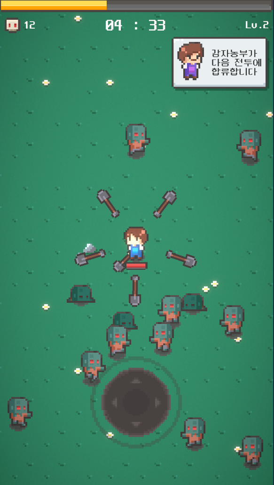
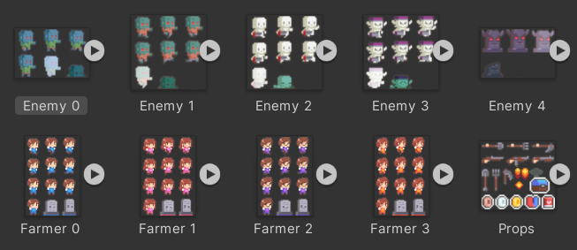
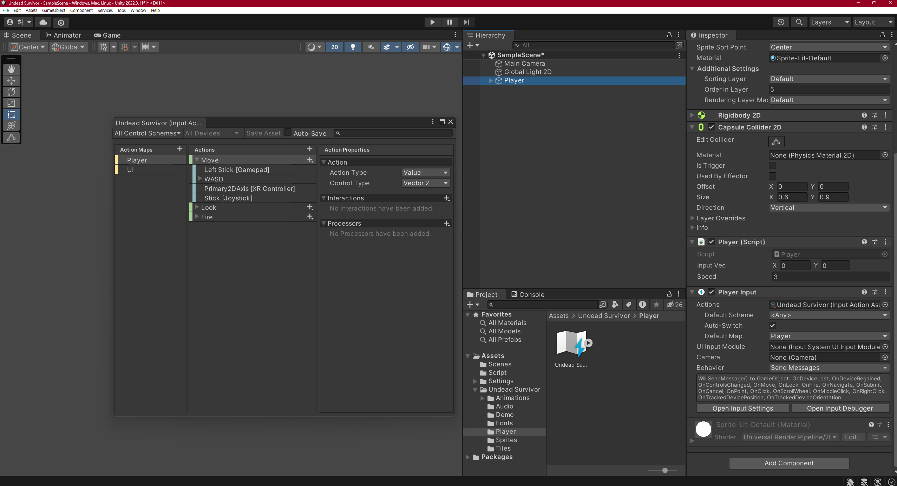
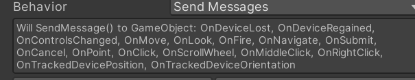
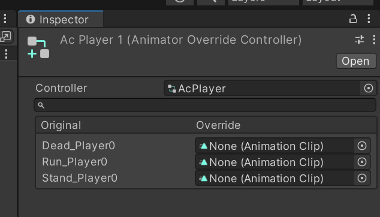
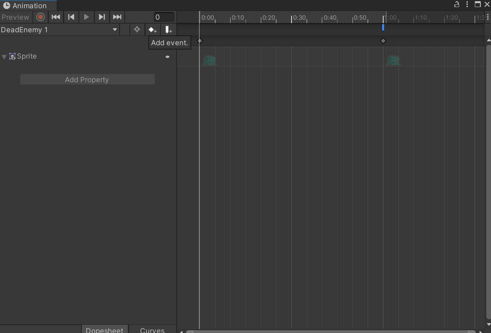
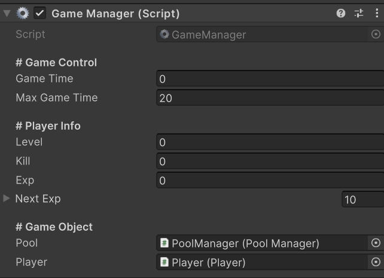
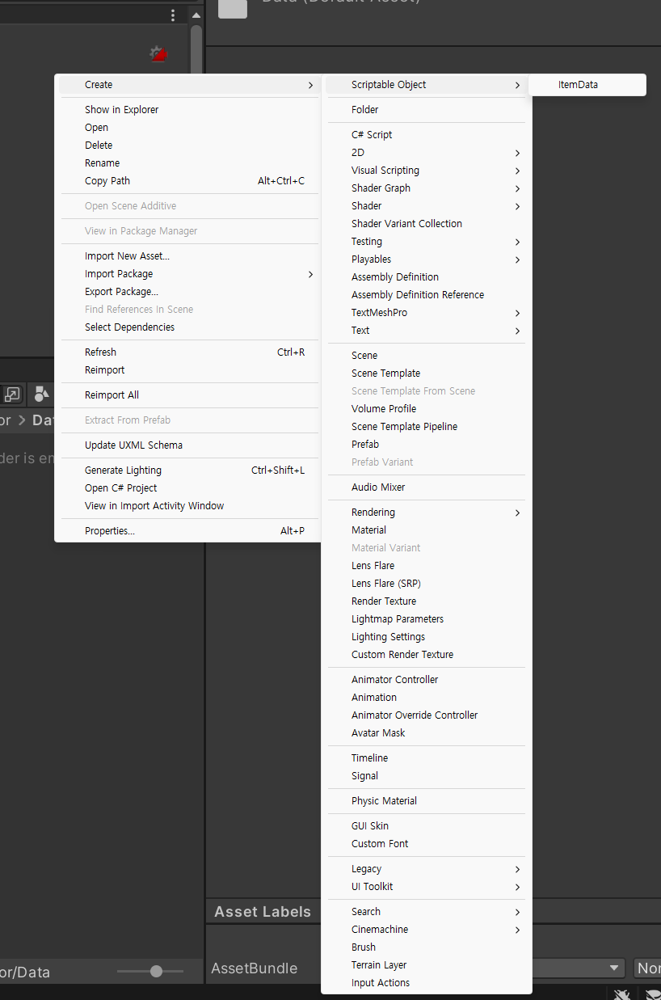

---

layout: single
title: "유니티 뱀서라이크"
categories: Unity
tag: [Unity, C#, Study]
toc: true
toc_sticky : true
author_profile: true
search: true

---

# < 유니티 뱀서라이크 >




## < 모든 스크립트 >

### Player.cs

```c#
using System;
using System.Collections;
using System.Collections.Generic;
using Unity.VisualScripting;
using UnityEngine;
using UnityEngine.PlayerLoop;
using UnityEngine.InputSystem;

public class Player : MonoBehaviour
{
    public Vector2 inputVec;
    public float speed;
    public Scanner scanner;
    public Hand[] hands;
    public RuntimeAnimatorController[] animCon;
    
    Rigidbody2D rigid;
    SpriteRenderer spriter;
    Animator anim;

    private void Awake()
    {
        rigid = GetComponent<Rigidbody2D>();
        spriter = GetComponent<SpriteRenderer>();
        anim = GetComponent<Animator>();
        scanner = GetComponent<Scanner>();
        hands = GetComponentsInChildren<Hand>(true);
    }

    void OnEnable()
    {
        speed *= Character.Speed;
        anim.runtimeAnimatorController = animCon[GameManager.instance.playerId];
    }

    void OnMove(InputValue value)
    {
        if (!GameManager.instance.isLive)
            return;
        
        inputVec = value.Get<Vector2>();
    }
    private void FixedUpdate()
    {
        if (!GameManager.instance.isLive)
            return;
        
        Vector2 nextVec = inputVec * (speed * Time.fixedDeltaTime);
        rigid.MovePosition(rigid.position + nextVec);
    }

    private void LateUpdate()
    {
        anim.SetFloat("Speed", inputVec.magnitude);
        if (inputVec.x != 0)
        {
            spriter.flipX = inputVec.x < 0;
        }
    }

    void OnCollisionStay2D(Collision2D collision)
    {
        if (!GameManager.instance.isLive)
            return;

        GameManager.instance.health -= Time.deltaTime * 10;

        if (GameManager.instance.health < 0)
        {
            for (int index = 2; index < transform.childCount; index++)
            {
                transform.GetChild(index).gameObject.SetActive(false);
            }
            
            anim.SetTrigger("Dead");
            GameManager.instance.GameOver();
        }
    }
}
```

움직임 + 속도 + Flip + 적에 닿으면 health 감소, 구현


### Bullet.cs

```c#
using System;
using System.Collections;
using System.Collections.Generic;
using Unity.VisualScripting;
using UnityEngine;

public class Bullet : MonoBehaviour
{
    public float damage;
    public int per;

    private Rigidbody2D rigid;

    private void Awake()
    {
        rigid = GetComponent<Rigidbody2D>();
    }

    public void Init(float damage, int per, Vector3 dir)
    {
        this.damage = damage;
        this.per = per;

        if (per >= 0) // 원거리무기
        {
            rigid.velocity = dir * 15;
        }
    }

    void OnTriggerEnter2D(Collider2D collision)
    {
        if (!collision.CompareTag("Enemy") || per == -100)
            return;

        per--;

        if (per < 0)
        {
            rigid.velocity = Vector2.zero;
            gameObject.SetActive(false); // destroy 금지, 오브젝트 풀링으로 관리되고 있기 때문
        }
    }

    void OnTriggerExit2D(Collider2D collision)
    {
        if (!collision.CompareTag("Area") || per == -100)
            return;

        gameObject.SetActive(false);
    }
}
```

원거리 무기 적 통과 구현


### Reposition.cs

```c#
using System;
using System.Collections;
using System.Collections.Generic;
using Unity.VisualScripting;
using UnityEngine;
using Random = UnityEngine.Random;

public class Reposition : MonoBehaviour
{
    private Collider2D coll;

    void Awake()
    {
        coll = GetComponent<Collider2D>();
    }
    
    void OnTriggerExit2D(Collider2D collision)
    {
        if (!collision.CompareTag("Area"))
        {
            return;
        }

        Vector3 playerPos = GameManager.instance.player.transform.position;
        Vector3 myPos = transform.position;

        switch (transform.tag)
        {
            case "Ground":
                float diffX = playerPos.x - myPos.x;
                float diffY = playerPos.y - myPos.y;
                float dirX = diffX < 0 ? -1 : 1;
                float dirY = diffY < 0 ? -1 : 1;
                diffX = Mathf.Abs(diffX);
                diffY = Mathf.Abs(diffY);

                if (diffX > diffY)
                    transform.Translate(Vector3.right * dirX * 40);
                else if (diffX < diffY)
                    transform.Translate(Vector3.up * dirY * 40);
                break;
            case "Enemy": // 무한맵처럼, 적도 플레이어로부터 멀어지면 다시 등장하게 해야한다
                if (coll.enabled)
                {
                    Vector3 dist = playerPos - myPos;
                    Vector3 ran = new Vector3(Random.Range(-3, 3), Random.Range(-3, 3), 0);
                    transform.Translate(ran + dist * 2);
                }
                break;
        }
    }
}
```

무한맵 생성 로직


### Enemy.cs

```c#
using System;
using System.Collections;
using System.Collections.Generic;
using Unity.VisualScripting;
using UnityEngine;
using UnityEngine.PlayerLoop;

public class Enemy : MonoBehaviour
{
    public float speed;
    public float health;
    public float maxHealth;
    public RuntimeAnimatorController[] animCon;
    public Rigidbody2D target;

    private bool isLive;

    private Rigidbody2D rigid;
    private Collider2D coll;
    private Animator anim;
    private SpriteRenderer spriter;
    private WaitForFixedUpdate wait;
    void Awake()
    {
        rigid = GetComponent<Rigidbody2D>();
        coll = GetComponent<Collider2D>();
        anim = GetComponent<Animator>();
        spriter = GetComponent<SpriteRenderer>();
        wait = new WaitForFixedUpdate();
    }

    private void FixedUpdate()
    {
        if (!GameManager.instance.isLive)
            return;
        
        if (!isLive || anim.GetCurrentAnimatorStateInfo(0).IsName("Hit")) return;
        
        Vector2 dirVec = target.position - rigid.position; // 방향은 적의 위치 - 나의 위치
        Vector2 nextVec = dirVec.normalized * speed * Time.fixedDeltaTime;
        rigid.MovePosition(rigid.position + nextVec);
        rigid.velocity = Vector2.zero;
    }

    private void LateUpdate()
    {
        if (!GameManager.instance.isLive)
            return;
        
        spriter.flipX = target.position.x < rigid.position.x;
    }

    private void OnEnable()
    {
        target = GameManager.instance.player.GetComponent<Rigidbody2D>();
        isLive = true;
        coll.enabled = true;
        rigid.simulated = true;
        spriter.sortingOrder = 2;
        anim.SetBool("Dead", false);
        health = maxHealth;
    }

    public void Init(SpawnData data)
    {
        anim.runtimeAnimatorController = animCon[data.spriteType];
        speed = data.speed;
        maxHealth = data.health;
        health = data.health;
    }

    void OnTriggerEnter2D(Collider2D collision)
    {
        if (!collision.CompareTag("Bullet") || !isLive)
            return;

        health -= collision.GetComponent<Bullet>().damage;
        StartCoroutine(KnockBack());

        if (health > 0)
        {
            anim.SetTrigger("Hit");
            AudioManager.instance.PlaySfx(AudioManager.Sfx.Hit);
        }
        else
        {
            isLive = false;
            coll.enabled = false;
            rigid.simulated = false;
            spriter.sortingOrder = 1;
            anim.SetBool("Dead",true);
            GameManager.instance.kill++;
            GameManager.instance.GetExp();
            
            if(GameManager.instance.isLive)
                AudioManager.instance.PlaySfx(AudioManager.Sfx.Dead);
        }
    }

    IEnumerator KnockBack()
    {
        yield return wait;
        Vector3 playerPos = GameManager.instance.player.transform.position;
        Vector3 dirVec = transform.position - playerPos;
        rigid.AddForce(dirVec.normalized * 3,ForceMode2D.Impulse);
    }
    
    void Dead()
    {
        gameObject.SetActive(false);
    }
}
```

player 방향으로 이동 + flip + 피격 + 죽음 + 넉백 구현


### Spawner.cs

```c#
using System;
using System.Collections;
using System.Collections.Generic;
using UnityEngine;
using Random = UnityEngine.Random;

public class Spawner : MonoBehaviour
{
    public Transform[] spawnPoint;
    public SpawnData[] spawnData;

    public float levelTime;
    
    private int level;
    private float timer;

    private void Awake()
    {
        spawnPoint = GetComponentsInChildren<Transform>();
        levelTime = GameManager.instance.maxGameTime / spawnData.Length;
    }

    private void Update()
    {
        if (!GameManager.instance.isLive)
            return;
        
        timer += Time.deltaTime;
        level = Mathf.Min(Mathf.FloorToInt(GameManager.instance.gameTime / levelTime), spawnData.Length - 1);
        
        if (timer > spawnData[level].spawnTime)
        {
            timer = 0;
            Spawn();
        }
    }

    void Spawn()
    {
        GameObject enemy = GameManager.instance.pool.Get(0);
        enemy.transform.position = spawnPoint[Random.Range(1, spawnPoint.Length)].position;
        enemy.GetComponent<Enemy>().Init(spawnData[level]);
    }
}

[System.Serializable]
public class SpawnData
{
    public int spriteType;
    public float spawnTime;
    public int health;
    public float speed;
}
```

적을 스폰하는 스포너 스크립트


### PoolManager.cs

```c#
using System;
using System.Collections;
using System.Collections.Generic;
using UnityEngine;

public class PoolManager : MonoBehaviour
{
    // 프리펩을 보관할 변수
    public GameObject[] prefabs;

    // 풀을 담당하는 리스트들
    private List<GameObject>[] pools;

    private void Awake()
    {
        pools = new List<GameObject>[prefabs.Length];

        for (int index = 0; index < pools.Length; index++)
        {
            pools[index] = new List<GameObject>(); // 생성자
        }
    }

    public GameObject Get(int index) // 게임 오브젝트를 반환하는 함수
    {
        GameObject select = null;
        
        // 선택한 풀의 놀고 (비활성화 된) 있는 게임오브젝트 접근

        foreach (GameObject item in pools[index])
        {
            if (!item.activeSelf)
            {
                // 발견하면 select 변수에 할당
                select = item;
                select.SetActive(true);
                break;
            }
        }
        
        // 못찾았으면?
        // 새롭게 생성하고 select 변수에 할당

        if (select == null)
        {
            select = Instantiate(prefabs[index], transform);
            pools[index].Add(select);
        }

        return select;
    }
}
```

적 생성을 최적화 하기 위한 PoolManager 스크립트


### GameManager.cs

```C#
using System;
using System.Collections;
using System.Collections.Generic;
using UnityEngine;
using UnityEngine.SceneManagement;

public class GameManager : MonoBehaviour
{
    public static GameManager instance;

    [Header("# Game Control")]
    public bool isLive;
    public float gameTime;
    public float maxGameTime = 2 * 10f;

    [Header("# Player Info")]
    public int playerId;
    public float health;
    public float maxHealth = 100;
    public int level;
    public int kill;
    public int exp;
    public int[] nextExp = { 3, 5, 10, 100, 150, 210, 280, 360, 450, 600 };
    
    [Header("# Game Object")]
    public PoolManager pool;
    public Player player;
    public LevelUp uiLevelUp;
    public Result uiResult;
    public GameObject enemyCleaner;
    public Transform uiJoy;

    void Awake()
    {
        instance = this;
        Application.targetFrameRate = 60;
    }

    public void GameStart(int id)
    {
        playerId = id;
        health = maxHealth;
        
        player.gameObject.SetActive(true);
        uiLevelUp.Select(playerId % 2);
        Resume();

        AudioManager.instance.PlayBgm(true);
        AudioManager.instance.PlaySfx(AudioManager.Sfx.Select);
    }

    public void GameOver()
    {
        StartCoroutine(GameOverRoutine());
    }

    IEnumerator GameOverRoutine()
    {
        isLive = false;
        
        yield return new WaitForSeconds(0.5f);

        uiResult.gameObject.SetActive(true);
        uiResult.Lose();
        Stop();
        
        AudioManager.instance.PlayBgm(false);
        AudioManager.instance.PlaySfx(AudioManager.Sfx.Lose);
    }
    
    public void GameVictory()
    {
        StartCoroutine(GameVictroyRoutine());
    }

    IEnumerator GameVictroyRoutine()
    {
        isLive = false;
        enemyCleaner.SetActive(true);
        yield return new WaitForSeconds(0.5f);

        uiResult.gameObject.SetActive(true);
        uiResult.Win();
        Stop();
        
        AudioManager.instance.PlayBgm(false);
        AudioManager.instance.PlaySfx(AudioManager.Sfx.Win);
    }
    
    public void GameRetry()
    {
        SceneManager.LoadScene(0);
    }
    
    public void GameQuit()
    {
        Application.Quit();
    }
    
    private void Update()
    {
        if (!isLive)
            return;
        
        gameTime += Time.deltaTime;

        if (gameTime > maxGameTime)
        {
            gameTime = maxGameTime;
            GameVictory();
        }
    }

    public void GetExp()
    {
        if (!isLive)
            return;
        
        exp++;

        if (exp == nextExp[Mathf.Min(level, nextExp.Length-1)])
        {
            level++;
            exp = 0;
            uiLevelUp.Show();
        }
    }

    public void Stop()
    {
        isLive = false;
        Time.timeScale = 0;
        uiJoy.localScale = Vector3.zero;
    }

    public void Resume()
    {
        isLive = true;
        Time.timeScale = 1;
        uiJoy.localScale = Vector3.one;
    }
}
```

프레임 + 게임시작과 종료 + 승리, 패배 + 재시작 + 게임 진행 시간 + 경험치 구현


### Scanner.cs

```c#
using System;
using System.Collections;
using System.Collections.Generic;
using UnityEngine;
using UnityEngine.PlayerLoop;

public class Scanner : MonoBehaviour
{
    public float scanRange;
    public LayerMask targetLayer;
    public RaycastHit2D[] targets;
    public Transform nearestTarget;

    private void FixedUpdate()
    {
        targets = Physics2D.CircleCastAll(transform.position, scanRange, Vector2.zero, 0, targetLayer);
        nearestTarget = GetNearest();
    }

    Transform GetNearest()
    {
        Transform result = null;
        float diff = 100;

        foreach (RaycastHit2D target in targets)
        {
            Vector3 myPos = transform.position;
            Vector3 targetPos = target.transform.position;
            float curDiff = Vector3.Distance(myPos, targetPos);

            if (curDiff < diff)
            {
                diff = curDiff;
                result = target.transform;
            }
        }
        
        return result;
    }
}
```

원거리 공격할때 제일 가까운 적 공격하기 구현


### ItemData.cs

```c#
using System.Collections;
using System.Collections.Generic;
using UnityEngine;

[CreateAssetMenu(fileName = "Item", menuName = "Scriptable Object/ItemData")]
public class ItemData : ScriptableObject
{
    public enum ItemType { Melee, Range, Glove, Shoe, Heal }

    [Header("# Main Info")]
    public ItemType itemType;
    public int itemId;
    public string itemName;
    
    [TextArea]
    public string itemDesc;
    public Sprite itemIcon;

    [Header("# Level Data")]
    public float baseDamage;
    public int baseCount;
    public float[] damages;
    public int[] counts;

    [Header("# Weapon")]
    public GameObject projectile;
    public Sprite hand;
}
```


### Gear.cs

```c#
using System.Collections;
using System.Collections.Generic;
using UnityEngine;

public class Gear : MonoBehaviour
{
    public ItemData.ItemType type;
    public float rate;

    public void Init(ItemData data)
    {
        name = "Gear" + data.itemId;
        transform.parent = GameManager.instance.player.transform;
        transform.localPosition = Vector3.zero;

        type = data.itemType;
        rate = data.damages[0];
        ApplyGear();
    }

    public void LevelUp(float rate)
    {
        this.rate = rate;
        ApplyGear();
    }

    void ApplyGear()
    {
        switch (type)
        {
            case ItemData.ItemType.Glove:
                RateUp();
                break;
            case ItemData.ItemType.Shoe :
                SpeedUp();
                break;
        }
    }

    void RateUp()
    {
        Weapon[] weapons = transform.parent.GetComponentsInChildren<Weapon>();

        foreach (Weapon weapon in weapons)
        {
            switch (weapon.id)
            {
                case 0:
                    float speed = 150 * Character.WeaponSpeed;
                    weapon.speed = speed + (speed * rate);
                    break;
                default:
                    speed = 0.5f * Character.WeaponRate;
                    weapon.speed = speed * (1f - rate);
                    break;
            }
        }
    }

    void SpeedUp()
    {
        float speed = 3 * Character.Speed;
        GameManager.instance.player.speed = speed + speed * rate;
    }
}
```


### Item.cs

```c#
using System;
using System.Collections;
using System.Collections.Generic;
using Unity.VisualScripting;
using UnityEngine;
using UnityEngine.UI;

public class Item : MonoBehaviour
{
    public ItemData data;
    public int level;
    public Weapon weapon;
    public Gear gear;

    private Image icon;
    private Text textLevel;
    private Text textName;
    private Text textDesc;

    private void Awake()
    {
        icon = GetComponentsInChildren<Image>()[1];
        icon.sprite = data.itemIcon;

        Text[] texts = GetComponentsInChildren<Text>();
        textLevel = texts[0];
        textName = texts[1];
        textDesc = texts[2];
        textName.text = data.itemName;
    }

    void OnEnable()
    {
        textLevel.text = "Lv." + (level + 1);

        switch (data.itemType)
        {
            case ItemData.ItemType.Melee:
            case ItemData.ItemType.Range:
                textDesc.text = string.Format(data.itemDesc, data.damages[level] * 100, data.counts[level]);
                break;
            case ItemData.ItemType.Glove:
            case ItemData.ItemType.Shoe:
                textDesc.text = string.Format(data.itemDesc, data.damages[level] * 100);
                break;
            default:
                textDesc.text = string.Format(data.itemDesc);
                break;
        }
    }

    public void OnClick()
    {
        switch (data.itemType)
        {
            case ItemData.ItemType.Melee:
            case ItemData.ItemType.Range:
                if (level == 0)
                {
                    GameObject newWeapon = new GameObject();
                    weapon = newWeapon.AddComponent<Weapon>();
                    weapon.Init(data);
                }
                else
                {
                    float nextDamage = data.baseDamage;
                    int nextCount = 0;

                    nextDamage += data.baseDamage * data.damages[level];
                    nextCount += data.counts[level];
                    
                    weapon.LevelUP(nextDamage,nextCount);
                }
                level++;
                break;
            case ItemData.ItemType.Glove:
            case ItemData.ItemType.Shoe:
                if (level == 0)
                {
                    GameObject newGear = new GameObject();
                    gear = newGear.AddComponent<Gear>();
                    gear.Init(data);
                }
                else
                {
                    float nextRate = data.damages[level];
                    gear.LevelUp(nextRate);
                }
                level++;
                break;
            case ItemData.ItemType.Heal:
                GameManager.instance.health = GameManager.instance.maxHealth;
                break;
        }

        if (level == data.damages.Length)
        {
            GetComponent<Button>().interactable = false;
        }
    }
}
```


### Weapon.cs

```c#
using System;
using System.Collections;
using System.Collections.Generic;
using Unity.IO.LowLevel.Unsafe;
using UnityEngine;

public class Weapon : MonoBehaviour
{
    public int id;
    public int prefabId;
    public float damage;
    public int count;
    public float speed;

    private float timer;
    private Player player;

    private void Awake()
    {
        player = GameManager.instance.player;
    }
    
    private void Update()
    {
        if (!GameManager.instance.isLive)
            return;
        
        switch (id)
        {
            case 0:
                transform.Rotate(Vector3.back * speed * Time.deltaTime);
                break;
            default:
                timer += Time.deltaTime;

                if (timer > speed)
                {
                    timer = 0f;
                    Fire();
                }
                break;
        }

        if (Input.GetButtonDown("Jump"))
        {
            LevelUP(10,1);
        }
    }

    public void Init(ItemData data)
    {
        // Basic Set
        name = "Weapon " + data.itemId;
        transform.parent = player.transform;
        transform.localPosition = Vector3.zero;
        
        // Property Set
        id = data.itemId;
        damage = data.baseDamage * Character.Damage;
        count = data.baseCount + Character.Count;

        for (int index = 0; index < GameManager.instance.pool.prefabs.Length; index++)
        {
            if (data.projectile == GameManager.instance.pool.prefabs[index])
            {
                prefabId = index;
                break;
            }
        }
        switch (id)
        {
            case 0:
                speed = 150 * Character.WeaponSpeed;
                Batch();
                break;
            default:
                speed = 0.5f * Character.WeaponRate;
                break;
        }

        Hand hand = player.hands[(int)data.itemType];
        hand.spriter.sprite = data.hand;
        hand.gameObject.SetActive(true);
        
        player.BroadcastMessage("ApplyGear", SendMessageOptions.DontRequireReceiver);
    }

    public void LevelUP(float damage, int count)
    {
        this.damage = damage * Character.Damage;
        this.count += count;

        if (id == 0)
        {
            Batch();
        }
        
        player.BroadcastMessage("ApplyGear", SendMessageOptions.DontRequireReceiver);
    }

    void Batch()
    {
        for (int index = 0; index < count; index++)
        {
            Transform bullet;

            if (index < transform.childCount)
            {
                bullet = transform.GetChild(index);
            }
            else
            {
                bullet = GameManager.instance.pool.Get(prefabId).transform;
                bullet.parent = transform;
            }

            bullet.localPosition = Vector3.zero;
            bullet.localRotation = Quaternion.identity;
            
            Vector3 rotVec = Vector3.forward * 360 * index / count;
            bullet.Rotate(rotVec);
            bullet.Translate(bullet.up * 1.5f, Space.World);
            bullet.GetComponent<Bullet>().Init(damage, -100, Vector3.zero); // -100 is Infinity Per;
        }
    }

    void Fire()
    {
        if (!player.scanner.nearestTarget) return;

        Vector3 targetPos = player.scanner.nearestTarget.position;
        Vector3 dir = targetPos - transform.position;
        dir = dir.normalized;
        
        Transform bullet = GameManager.instance.pool.Get(prefabId).transform;
        bullet.position = transform.position;
        bullet.rotation = Quaternion.FromToRotation(Vector3.up, dir);
        bullet.GetComponent<Bullet>().Init(damage, count, dir);
        
        AudioManager.instance.PlaySfx(AudioManager.Sfx.Range);
    }
}
```


### LevelUp.cs

```c#
using System;
using System.Collections;
using System.Collections.Generic;
using UnityEngine;
using Random = UnityEngine.Random;

public class LevelUp : MonoBehaviour
{
    private RectTransform rect;
    private Item[] items;

    private void Awake()
    {
        rect = GetComponent<RectTransform>();
        items = GetComponentsInChildren<Item>(true);
    }

    public void Show()
    {
        Next();
        rect.localScale = Vector3.one;
        GameManager.instance.Stop();
        AudioManager.instance.PlaySfx(AudioManager.Sfx.LevelUp);
        AudioManager.instance.EffectBgm(true);
    }

    public void Hide()
    {
        rect.localScale = Vector3.zero;
        GameManager.instance.Resume();
        AudioManager.instance.PlaySfx(AudioManager.Sfx.Select);
        AudioManager.instance.EffectBgm(false);
    }

    public void Select(int index)
    {
        items[index].OnClick();
    }

    void Next()
    {
        // 1. 모든 아이템 비활성화
        foreach (Item item in items)
        {
            item.gameObject.SetActive(false);
        }

        // 2. 그 중에서 랜덤 3개 아이템 활성화
        int[] ran = new int[3];
        while (true)
        {
            ran[0] = Random.Range(0, items.Length);
            ran[1] = Random.Range(0, items.Length);
            ran[2] = Random.Range(0, items.Length);

            if (ran[0] != ran[1] && ran[1] != ran[2] && ran[0] != ran[2])
                break;
        }

        // 3. 만렙 아이템의 경우는 소비아이템으로 대체
        for (int index = 0; index < ran.Length; index++)
        {
            Item ranItem = items[ran[index]];

            if (ranItem.level == ranItem.data.damages.Length)
            {
                items[4].gameObject.SetActive(true);
            }
            else
            {
                ranItem.gameObject.SetActive(true);
            }
        }
    }
}
```


### AchiveManager.cs

```c#
using System;
using System.Collections;
using System.Collections.Generic;
using UnityEngine;

public class AchiveManager : MonoBehaviour
{
    public GameObject[] lockCharacter;
    public GameObject[] unlockCharacter;
    public GameObject uiNotice;
    
    enum Achive {UnlockPotato, UnlockBean}
    private Achive[] achives;

    private WaitForSecondsRealtime wait;

    private void Awake()
    {
        achives = (Achive[])Enum.GetValues(typeof(Achive));
        wait = new WaitForSecondsRealtime(5);

        if (!PlayerPrefs.HasKey("MyData"))
        {
            Init();
        }
    }

    void Start()
    {
        UnlockCharacter();
    }

    void UnlockCharacter()
    {
        for (int index = 0; index < lockCharacter.Length; index++)
        {
            string achiveName = achives[index].ToString();
            bool isUnlock = PlayerPrefs.GetInt(achiveName) == 1;
            lockCharacter[index].SetActive(!isUnlock);
            unlockCharacter[index].SetActive(isUnlock);
        }
    }
    void Init()
    {
        PlayerPrefs.SetInt("MyData", 1);

        foreach (Achive achive in achives)
        {
            PlayerPrefs.SetInt(achive.ToString(), 0);
        }
    }

    private void LateUpdate()
    {
        foreach (Achive achive in achives)
        {
            CheckAchive(achive);
        }
    }

    void CheckAchive(Achive achive)
    {
        bool isAchive = false;

        switch (achive)
        {
            case Achive.UnlockPotato:
                isAchive = GameManager.instance.kill >= 10;
                break;
            case Achive.UnlockBean:
                isAchive = GameManager.instance.gameTime == GameManager.instance.maxGameTime;
                break;
        }

        if (isAchive && PlayerPrefs.GetInt(achive.ToString()) == 0)
        {
            PlayerPrefs.SetInt(achive.ToString(), 1);

            for (int index = 0; index < uiNotice.transform.childCount; index++)
            {
                bool isActive = index == (int)achive;
                uiNotice.transform.GetChild(index).gameObject.SetActive(isActive);
            }
            StartCoroutine(NoticeRoutine());

        }
    }

    IEnumerator NoticeRoutine()
    {
        uiNotice.SetActive(true);
        AudioManager.instance.PlaySfx(AudioManager.Sfx.LevelUp);
        
        yield return wait;

        uiNotice.SetActive(false);
    }
}
```

업적 달성시 캐릭터 언락


### Hand.cs

```c#
using System;
using System.Collections;
using System.Collections.Generic;
using UnityEngine;

public class Hand : MonoBehaviour
{
    public bool isLeft;
    public SpriteRenderer spriter;

    private SpriteRenderer player;

    private Vector3 rightPos = new Vector3(0.35f, -0.15f, 0);
    private Vector3 rightPosReverse = new Vector3(-0.15f, -0.15f, 0);
    private Quaternion leftRot = Quaternion.Euler(0, 0, -35);
    private Quaternion leftRotReverse = Quaternion.Euler(0, 0, -135);
    private void Awake()
    {
        player = GetComponentsInParent<SpriteRenderer>()[1];
    }

    private void LateUpdate()
    {
        bool isReverse = player.flipX;

        if (isLeft)
        {
            transform.localRotation = isReverse ? leftRotReverse : leftRot;
            spriter.flipY = isReverse;
            spriter.sortingOrder = isReverse ? 4 : 6;
        }
        else
        {
            transform.localPosition = isReverse ? rightPosReverse : rightPos;
            spriter.flipX = isReverse;
            spriter.sortingOrder = isReverse ? 6 : 4;
        }
    }
}
```


### Character.cs

```c#
using System.Collections;
using System.Collections.Generic;
using UnityEngine;

public class Character : MonoBehaviour
{
    public static float Speed
    {
        get { return GameManager.instance.playerId == 0 ? 1.1f : 1f; }
    }
    
    public static float WeaponSpeed
    {
        get { return GameManager.instance.playerId == 1 ? 1.1f : 1f; }
    }
    
    public static float WeaponRate
    {
        get { return GameManager.instance.playerId == 1 ? 0.9f : 1f; }
    }
    
    public static float Damage
    {
        get { return GameManager.instance.playerId == 2 ? 1.2f : 1f; }
    }
    
    public static int Count
    {
        get { return GameManager.instance.playerId == 3 ? 1 : 0; }
    }
}
```


### HUD.cs

```c#
using System;
using System.Collections;
using System.Collections.Generic;
using UnityEngine;
using UnityEngine.UI;

public class HUD : MonoBehaviour
{
    public enum InforType {Exp, Level, Kill, Time, Health}
    public InforType type;

    Text myText;
    private Slider mySlider;

    private void Awake()
    {
        myText = GetComponent<Text>();
        mySlider = GetComponent<Slider>();
    }

    private void LateUpdate()
    {
        switch (type)
        {
            case InforType.Exp:
                float curExp = GameManager.instance.exp;
                float maxExp = GameManager.instance.nextExp[Mathf.Min(GameManager.instance.level, GameManager.instance.nextExp.Length - 1)];
                mySlider.value = curExp / maxExp;
                break;
            case InforType.Level:
                myText.text = string.Format("Lv.{0:F0}", GameManager.instance.level);
                break;
            case InforType.Kill:
                myText.text = string.Format("{0:F0}", GameManager.instance.kill);
                break;
            case InforType.Time:
                float remainTime = GameManager.instance.maxGameTime - GameManager.instance.gameTime;
                int min = Mathf.FloorToInt(remainTime / 60);
                int sec = Mathf.FloorToInt(remainTime % 60);
                myText.text = string.Format("{0:D2} : {1:D2}", min, sec);
                break;
            case InforType.Health:
                float curHealth = GameManager.instance.health;
                float maxHealth = GameManager.instance.maxHealth;
                mySlider.value = curHealth / maxHealth;
                break;
        }
    }
}
```


### Follow.cs

```c#
using System;
using System.Collections;
using System.Collections.Generic;
using UnityEngine;

public class Follow : MonoBehaviour
{
    private RectTransform rect;
    
    void Awake()
    {
        rect = GetComponent<RectTransform>();
    }

    private void FixedUpdate()
    {
        rect.position = Camera.main.WorldToScreenPoint(GameManager.instance.player.transform.position);
    }
}
```


### Result.cs

```c#
using System.Collections;
using System.Collections.Generic;
using UnityEngine;

public class Result : MonoBehaviour
{
    public GameObject[] titles;

    public void Lose()
    {
        titles[0].SetActive(true);
    }

    public void Win()
    {
        titles[1].SetActive(true);
    }
}
```


### AudioManager.cs

```c#
using System.Collections;
using System.Collections.Generic;
using UnityEngine;
using UnityEngine.PlayerLoop;

public class AudioManager : MonoBehaviour
{
    public static AudioManager instance;

    [Header("#BGM")]
    public AudioClip bgmClip;
    public float bgmVolume;
    private AudioSource bgmPlayer;
    private AudioHighPassFilter bgmEffect;
    
    [Header("#SFX")]
    public AudioClip[] sfxClips;
    public float sfxVolume;
    public int channels;
    private AudioSource[] sfxPlayers;
    private int channelIndex;

    public enum Sfx {Dead, Hit, LevelUp=3, Lose, Melee, Range = 7, Select, Win}

    void Awake()
    {
        instance = this;
        Init();
    }

    void Init()
    {
        // 배경음 플레이어 초기화
        GameObject bgmObject = new GameObject("BgmPlayer");
        bgmObject.transform.parent = transform;
        bgmPlayer = bgmObject.AddComponent<AudioSource>();
        bgmPlayer.playOnAwake = false;
        bgmPlayer.loop = true;
        bgmPlayer.volume = bgmVolume;
        bgmPlayer.clip = bgmClip;
        bgmEffect = Camera.main.GetComponent<AudioHighPassFilter>();

        // 효과음 플레이어 초기화
        GameObject sfxObject = new GameObject("SfxPlayer");
        sfxObject.transform.parent = transform;
        sfxPlayers = new AudioSource[channels];

        for (int index = 0; index < sfxPlayers.Length; index++)
        {
            sfxPlayers[index] = sfxObject.AddComponent<AudioSource>();
            sfxPlayers[index].playOnAwake = false;
            sfxPlayers[index].bypassListenerEffects = true;
            sfxPlayers[index].volume = sfxVolume;
        }
    }

    public void PlayBgm(bool isPlay)
    {
        if (isPlay)
        {
            bgmPlayer.Play();
        }
        else
        {
            bgmPlayer.Stop();
        }
    }
    
    public void EffectBgm(bool isPlay)
    {
        bgmEffect.enabled = isPlay;
    }
    
    public void PlaySfx(Sfx sfx)
    {
        for (int index = 0; index < sfxPlayers.Length; index++)
        {
            int loopIndex = (index + channelIndex) % sfxPlayers.Length;

            if (sfxPlayers[loopIndex].isPlaying)
                continue;

            int ranIndex = 0;
            if (sfx == Sfx.Hit || sfx == Sfx.Melee)
            {
                ranIndex = Random.Range(0, 2);
            }
            channelIndex = loopIndex;
            sfxPlayers[loopIndex].clip = sfxClips[(int)sfx + ranIndex];
            sfxPlayers[loopIndex].Play();

            break;
        }
    }
}
```


## < 2D 오브젝트 만들기 >

### 아틀라스  or  스프라이트 시트



여러 스프라이트가 하나로 묶인 형태


### 픽셀아트 스프라이트 사전 설정

1. Pixel Per Unit : 주 캐릭터의 실제 크기로 설정
2. Filter Mode : Point로 변경
3. Compression : None으로 설정


## < 플레이어 이동 구현하기 >

### Input Manager를 사용해서 움직이는 법

#### MonoBeaviour

게임 로직 구성에 필요한 것들을 가진 클래스


#### MovePosition

위치 이동이라 현재 위치도 더해주어야 한다


#### fixedDeltaTime

물리 프레임 하나가 소비한 시간

fixedDeltatime은 fixedupdate에서, deltatime은 update에서 사용한다


### Input System을 활용한 이동 구현




프로필 에셋만으로 다양한 디바이스 인풋을 쉽게 관리할수 있다

Add Component -> Player Input 추가 -> Create Action 클릭 -> 프로필 에셋 저장




위에 명시된대로 다양한 함수를 구현해서 사용 가능하다


#### Action Type

버튼 클릭인지, 값을 내보내는것인지 구분


#### Control Type

컨트롤 타입으로 값의 형식을 결정


#### Interactions

인터렉션으로 인풋의 호출 타이밍 지정


#### Processors

인풋의 값을 후보정 해줄수 있다


-> 설정 변경 후 Save Asset 꼭 하기


### using UnityEngine.InputSystem;

향상된 인풋 시스템을 사용할땐 위의 네임스페이스 꼭 사용하기


### OnMove

OnMove 함수를 이용해 inputVec에 값을 꼭 넣어줘야 함


### Get<T>

프로필에서 설정한 컨트롤 타입 T값을 가져오는 함수


## < 2D 셀 애니메이션 제작하기 >


### 플레이어 뒤집기

Sprite Renderer 에 있는 flip을 사용하여 구현


### 셀 에니메이션

여러 장의 스프라이트를 보여주는 방식


### Magnitude

벡터의 순수한 크기 값


### Animation Controller Overidte

에니메이션만 덮어 씌우는 에셋





무슨 애니메이션 컨트롤러를 오버라이드 할껀지 지정하고, 에니메이션만 넣으면 된다


## < 무한 맵 이동 >

### Tilemap Collider 2D

타일맵을 위한 콜라이더 2D


### Composite Collider 2D

타일마다 나눠진 형태를 하나로 합치는 컴포넌트

Tilemap Collider 2D에서 Used By Composite를 체크해야지 적용된다


### Static

정적으로 사용하겠다는 키워드. 바로 메모리에 얹어버린다

Static으로 선언된 변수는 인스펙터에 나타나지 않는다


정적변수는 즉시 클래스에서 부를 수 있다는 편리함이 있다


### Chinemachine 내장 패키지

Virtaul Camera가 카메라 감독 역할을 한다

Vitaul Camera에서 Follow를 player로 지정해주면 카메라가 플레이어를 따라다닌다

플레이어 이동을 FixedUpdate에서 하기 때문에

Main Camera의 Update Method를 FixedUpdate로 변경해야한다


## < 몬스터 만들기 >

### 플레이어와 적 방향 구하기

```c#
 Vector2 dirVec = target.position - rigid.position; // 방향은 적의 위치 - 나의 위치
Vector2 nextVec = dirVec.normalized * speed * Time.fixedDeltaTime; // 이후 normalized 까지 해주어야한다
```


## < 오브젝트 풀링 >

```c#
// PoolManager.cs

using System;
using System.Collections;
using System.Collections.Generic;
using UnityEngine;

public class PoolManager : MonoBehaviour
{
    // 프리펩을 보관할 변수
    public GameObject[] prefabs;

    // 풀을 담당하는 리스트들
    private List<GameObject>[] pools;

    private void Awake()
    {
        pools = new List<GameObject>[prefabs.Length];

        for (int index = 0; index < pools.Length; index++)
        {
            pools[index] = new List<GameObject>(); // 생성자
        }
    }

    public GameObject Get(int index) // 게임 오브젝트를 반환하는 함수
    {
        GameObject select = null;
        
        // 선택한 풀의 놀고 (비활성화 된) 있는 게임오브젝트 접근

        foreach (GameObject item in pools[index])
        {
            if (!item.activeSelf)
            {
                // 발견하면 select 변수에 할당
                select = item;
                select.SetActive(true);
                break;
            }
        }
        
        // 못찾았으면?
        // 새롭게 생성하고 select 변수에 할당

        if (select == null)
        {
            select = Instantiate(prefabs[index], transform);
            pools[index].Add(select);
        }

        return select;
    }
}
```


### GetComponentsInChildren

이 함수는 자식 오브젝트에 접근하는 함수인데

첫번째로 자기 자신도 포함된다


### FloorToInt

소수점 아래는 버리고 Int형으로 바꾸는 함수


### CeilToInt

소수점 아래를 올리고 Int형으로 바꾸는 함수


### 직렬화

개체를 저장 혹은 전송하기 위해 변환 

```c#
[System.Serializable]
```

를 붙여 속성을 부여,  직렬화가 되면서 인스펙터창에서도 변수를 볼수 있다

직접 작성한 클래스를 직렬화를 통하여 인스펙터에서 초기화가 가능하다


### runtimeAnimatorController

런타임 중에 애니메이터 컨트롤러를 교체하려면

runtimeAnimatorController를 사용하면 된다


## < 회전 하는 근접 무기 구현 >

### parent

parent 속성을 통해 부모 변경


#### transform.childCount

자식 오브젝트의 개수를 가져온다


### transform.GetChild()

인덱스 번호로  해당하는 자식을 가져온다


## < 원거리 공격 구현 >

### CircleCastAll

원형의 캐스트를 쏘고 모든 결과를 반환하는 함수


### 콜라이더 리셋

콜라이더를 리셋하면 스프라이트 크기에 자동으로 맞춰진다


### GetComponentInParent

부모의 컴포넌트 가져오기 ( 자식 오브젝트로 있을 때 )


## < 몬스터 처치 >

### anim.GetCurrentAnimatorStateInfo()

```c#
if (!isLive || anim.GetCurrentAnimatorStateInfo(0).IsName("Hit")) return;
```

현재 정보 상태를 가져오는 함수

Hit 애니메이션이 실행중이라면 건너 뛴다는 의미이다


### 리지드바디의 물리적 비활성화

enable이 아니라 simulated로 설정해야한다


### sortingOrder

= Order in Layer와 동일


#### 애니메이션 이벤트



애니메이션이 실행되는 동안에 원하는 위치에  Add event를 통해서 스크립트 안에 있는 함수를 실행시켜줄수 있다


### Header

인스펙터의 속성들을 이쁘게 구분시켜주는 타이틀





## < HUD 제작하기 >

### Canvas Render Mode

Screen-Overlay : 스크린에 그대로 얹는 형태

Screen-Camera : 스크린을 카메라에 맞추는 형태

World Space : 월드 공간에 배치하는 형태


어느 해상도에서나 크기를 유지하는 것이 UI의 포인트 이다

-> Canvas Scaler 꼭 설정하기


### 월드 좌표와 스크린 좌표는 다르다

UI를 플레이어에 부착한다고 해서 플레이어 위치에 대입해버리면 안되고

월드 상의 오브젝트 위치를 스크린 좌표로 변환하는 함수를 사용해야한다


### Camera.main.WorldToScreenPoint() 

월드 상의 오브젝트 위치를 스크린 좌표로 변환하는 함수이다


## < 능력 업그레이드 구현 >

### ScriptableObject

대량의 데이터를 저장하는데 사용할수 있는 데이터 컨테이너 이다


### [CreateAseetMenu(fileName = " ", menuName = "")]

커스텀 메뉴를 생성하는 속성




### 스크립트블 오브젝트

다양한 데이터를 저장하는 에셋

 

### Vertical  Layout Group


### AddComponent<T>

게임 오브젝트에 T 컴포넌트를 추가하는 함수 


### BroadcastMessage

특정 함수 호출을 모든 자식에게 방송하는 함수


## < 레벨업 시스템 >

### TimeScale

유니티의 시간 속도 ( 배율 )


## < 무기 장착 표현하기 >

### GetComponentsInChildren<>(true)

인자값에 true를 넣으면 비활성화 된 오브젝트도 접근할수 있다


## < 게임 시작과 종료 >

### Outline

UI 그래픽을 기준으로 외곽선을 그리는 컴포넌트


### childCount

자식 오브젝트 개수


### GetChild

주어진 인덱스의 자식 오브젝트를 반환하는 함수


## < 플레이어 캐릭터 선택 >

### Grid Layout Group

자식 오브젝트를 그리드 형태로 정렬하는 컴포넌트


### Property ( 속성 )

get, set 키워드를 사용하여 클래스의 필드에 접근할수 있다

```c#
public class MyClass
{
    // Private 필드 (변수)
    private int myInt;

    // Public 프로퍼티
    public int MyInt
    {
        get { return myInt; }
        set { myInt = value; }
    }
}
```

이렇게 지정해놓으면,

```c#
MyClass myClass = new MyClass();

// MyInt 프로퍼티 값에 엑세스
int value = myClass.MyInt;

// MyInt 프로퍼티에 값을 지정
myClass.MyInt = 10;
```

다른 스크립트에서 위와 같은 방식으로 사용할수 있다


## < 캐릭터 해금 시스템 >

### Enum.GetValues

주어진 열거형의 데이터를 모두 가져오는 함수


### Edit > Clear all Playerprefs

모든 playerprefs를 지울수 있다


## < 오디오 시스템 구축 >

### AudioListener

Main Camera 안에 컴포넌트로 들어가 있다

AudioListener는 장면에서 재생 중인 오디오를 듣는 컴포넌트를 말한다


### Audio HighPass Filter

높은 음역대는 통과시키고 낮은 음역대는 막는 컴포넌트이다

필터에서 제외시키려면 Audio Source 안에 있는 Bypass Listener Effects를 활성화하면 된다


## < 마무리 >

### Global volume

메인 카메라의 post precessing을 체크해야 후처리가 들어간다


### Bloom

빛과 눈부심 효과


### Film Grain

필름 노이즈 효과

### Vignette

모서리 음영 처리 효과


### Application.targetFrameRate

게임 프레임 고정하기

