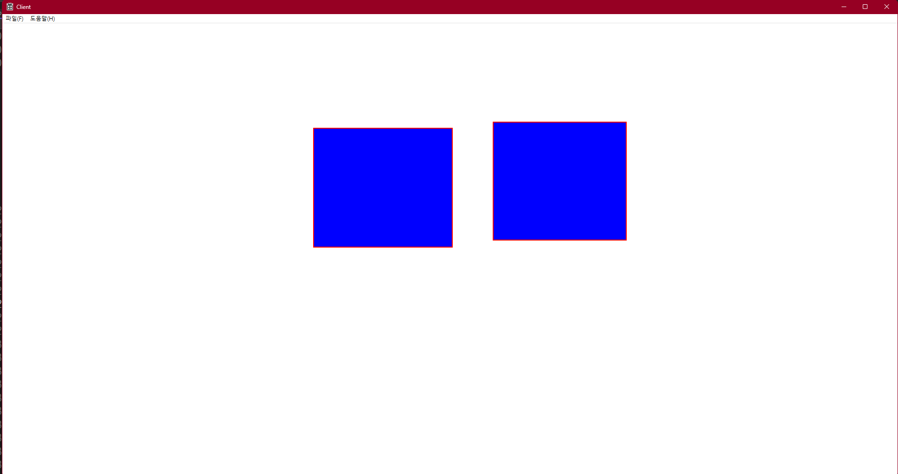

---

layout: single
title: "Win32API (2) 커널 오브젝트, 윈도우 핸들, 무효화 영역"
categories: Win32API
tag: [WIn32API, C++, Study]
toc: true
toc_sticky : true
author_profile: true
search: true

---

# 커널 오브젝트

윈도우 객체는 메모리에 잡혀있지만 OS가 관리하기 때문에 사용자 함부로 객체에 정보에 접근할 수 없다

-> OS가 관리하는 Curnel object는 이를 해결하기 위해 사용자에게 ID(Window Handle) , HWND hwnd를 준다

이 ID를 이용해서 객체를 조작할 수 있는 함수를 호출해 원하는 효과를 줄 수 있다

이와 비슷하게 HDC hdc 도 Curnel object로써 Device Context(그리기 관련)라는 객체를 만들어서 ID값을 얻은 것이다

HDC (Device Context)는 그리기 작업을 수행하는데 필요한 데이터들의 집합체이다

# 윈도우 핸들

운영체제는 리소스를 안전하게 관리하기 위해서 포인터 대신 핸들이라는 개념을 사용한다

핸들이란? 오브젝트의 주소를 나타내는 자료형이다 ( ID라고 생각하면 편하다 )

핸들은 H로 시작하는 접두어를 가지고, 커널 오브젝트로써 내부  데이터에 직접 접근하지는 못하고, 운영체제에서 제공하는 API 및 함수를 사용하여 핸들을 통해 리소스에 접근할수 있다

# 무효화 영역

다른 프로그램 창에 의해서 가려진 영역 ( 과거에는 그랬으나 현재는 조금 가려지더라도 무효화 영역이 발생하지 않는다 )

그러면 무효화영역이란 무엇일까?

현재는 윈도우창을 최소화 하고 다시 켰을때 WM_PAINT(무효화 영역)가 발생한다

WM_PAINT가 발생하는 경우 : 무효화 영역(invalidate Rect)이 발생한 경우


# 윈도우에 직사각형 그리기



```c++

#include <vector>

using std::vector;

struct tObjInfo
{
    POINT g_ptObjPos; // 정수 2개 있는 구조체
    POINT g_ptObjScale;
};

vector<tObjInfo> g_vecInfo;

// 좌 상단
POINT g_ptLT;

// 우 하단
POINT g_ptRB;

bool bLbtnDown = false;

LRESULT CALLBACK WndProc(HWND hWnd, UINT message, WPARAM wParam, LPARAM lParam)
{
    switch (message)
    {
    case WM_COMMAND:
        {
            int wmId = LOWORD(wParam);
            // 메뉴 선택을 구문 분석합니다:
            switch (wmId)
            {
            case IDM_ABOUT:
                DialogBox(hInst, MAKEINTRESOURCE(IDD_ABOUTBOX), hWnd, About);
                break;
            case IDM_EXIT:
                DestroyWindow(hWnd);
                break;
            default:
                return DefWindowProc(hWnd, message, wParam, lParam);
            }
        }
        break;
    case WM_PAINT: // 무효화 영역이 발생한 경우
        {
            PAINTSTRUCT ps;

            // Device Context 만들어서 ID를 반환
            HDC hdc = BeginPaint(hWnd, &ps); // hWnd(현재 윈도우)에 Device Context (그리기)
            // DC 의 목적지는 hWnd
            // DC 의 펜은 기본펜(Black)
            // DC 의 브러쉬는 기본 브러쉬(White)

            // 직접 펜을 만들어서 DC 에 지급
            HPEN hRedPen = CreatePen(PS_SOLID, 2, RGB(255,0,0));

            // 브러쉬 만들기, CreateSolidBrush도 있지만 자주 쓰는 브러쉬는 OS에서 만들어 놨다(GetStockObject 함수 사용)
            // GetStockObject로 얻은 브러쉬는 지우면 안된다
            HBRUSH hBlueBrush = CreateSolidBrush(RGB(0,0,255));

            // 기본 펜 ID 값을 hDefaultPen에 받아 둠
            // SelectObject 펜,브러쉬 바꾸기, 매우 범용적으로 사용된다 그래서 캐스팅을 해줘야함
            // 반환값은 이전에 있던 브러쉬 또는 펜
            HPEN hDefaultPen= (HPEN)SelectObject(hdc, hRedPen);
            HBRUSH hDefaultBrush = (HBRUSH)SelectObject(hdc, hBlueBrush);

            // 변경된 펜으로 사각형 그림
            if (bLbtnDown)
            {
                Rectangle(hdc, g_ptLT.x, g_ptLT.y, g_ptRB.x, g_ptRB.y);
            }

            for (size_t i = 0; i < g_vecInfo.size(); ++i)
            {
                Rectangle(hdc, g_vecInfo[i].g_ptObjPos.x - g_vecInfo[i].g_ptObjScale.x / 2
                    , g_vecInfo[i].g_ptObjPos.y - g_vecInfo[i].g_ptObjScale.y / 2
                    , g_vecInfo[i].g_ptObjPos.x + g_vecInfo[i].g_ptObjScale.x / 2
                    , g_vecInfo[i].g_ptObjPos.y + g_vecInfo[i].g_ptObjScale.y / 2);

            }

            // DC의 펜을 원래 펜으로 되돌림
            SelectObject(hdc, hDefaultPen);
            SelectObject(hdc, hDefaultBrush);

            // 다 쓴 Red펜 삭제 요청
            DeleteObject(hRedPen);
            DeleteObject(hBlueBrush);

            // 그리기 종료
            EndPaint(hWnd, &ps);
        }
        break;

    case WM_KEYDOWN:
    {
        switch (wParam)
        {
            case VK_UP:
                // g_ptObjPos.y -= 10;
                // 무효화 영역을 창에 직접 설정
                // 픽셀 메모리가 비어지는건 아니므로 화면 전체 영역에 대한 false를 true로 Clear를 해줘야한다
                // nullptr 는 전체 영역을 의미함
                InvalidateRect(hWnd, nullptr, true);
                break;

            case VK_DOWN:
                // g_ptObjPos.y += 10;
                InvalidateRect(hWnd, nullptr, true);
                break;

            case VK_LEFT:
                // g_ptObjPos.x -= 10;
                InvalidateRect(hWnd, nullptr, true);
                break;

            case VK_RIGHT:
                // g_ptObjPos.x += 10;
                InvalidateRect(hWnd, nullptr, true);
                break;
        }
    }
    break;

    case WM_LBUTTONDOWN:
    {
        g_ptLT.x = LOWORD(lParam);
        g_ptLT.y = HIWORD(lParam);
        bLbtnDown = true;
    }
        break;
    case WM_MOUSEMOVE:
        g_ptRB.x = LOWORD(lParam); // lParam의 하위 16비트는 x 좌표
        g_ptRB.y = HIWORD(lParam); // lParam의 상위 16비트는 y 좌표
        // InvalidateRect(hWnd, nullptr, true);
        break;
    case WM_LBUTTONUP:
    {
        tObjInfo info = {};
        info.g_ptObjPos.x= (g_ptLT.x + g_ptRB.x) / 2;
        info.g_ptObjPos.y = (g_ptLT.y + g_ptRB.y) / 2;

        info.g_ptObjScale.x = abs(g_ptLT.x - g_ptRB.x);
        info.g_ptObjScale.y = abs(g_ptLT.y - g_ptRB.y);

        g_vecInfo.push_back(info);

        bLbtnDown = false;
        InvalidateRect(hWnd, nullptr, true);
    }
    break;
    case WM_TIMER:

        break;
    case WM_DESTROY:
        PostQuitMessage(0);
        break;
    default:
        return DefWindowProc(hWnd, message, wParam, lParam);
    }
    return 0;
}
```

## IPARAM

IPARAM은  마우스의 좌표를 나타내는 2바이트 x 및 2바이트 y 좌표로 구성된다

## WParam

키보드 키를 누른 정보가 이곳에 들어온다

## CreatePen

펜 생성하는 함수

## SelectObject

펜 바꾸기 브러쉬 바꾸기 등 매우 범용적으로 사용된다

그래서 캐스팅을 반드시 해줘야한다

함수의 반환값은 바꾸기전의 브러쉬 또는 펜의 ID가 나온다

## nvalidateRect () 

무효화 영역을 창에 직접 설정

## WM_KEYDOWN

키를 누르면 발생하는 이벤트


## 픽셀

픽셀은 일반적으로 RGB(빨강, 녹색, 파랑) 색상 정보를 나타내는데

각 색상 채널은 보통 1바이트씩 (8비트)로 표현된다

0 ~ 255 까지의 값을 표현할수 있다
