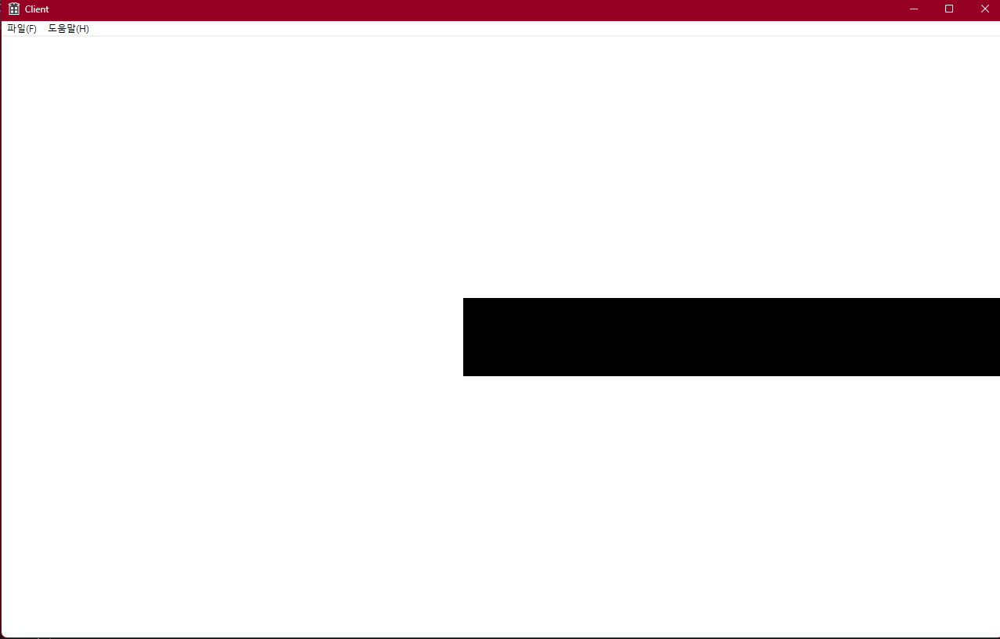

---

layout: single
title: "Win32API (4) Core 클래스"
categories: Win32API
tag: [WIn32API, C++, Study]
toc: true
toc_sticky : true
author_profile: true
search: true

---

```c++
// main.cpp 중 일부분
    while (1)
    {
        if (PeekMessage(&msg, nullptr, 0, 0, PM_REMOVE)) // 메세지가 확인된 경우
        {

            if (msg.message == WM_QUIT)
                break;

            if (!TranslateAccelerator(msg.hwnd, hAccelTable, &msg))
            {
                TranslateMessage(&msg);
                DispatchMessage(&msg);
            }
        }
        else // 메세지가 발생하지 않는 대부분의 시간
        {
            CCore::GetInst()->progress();
        }
    }
```


```c++
// CCore.h
#pragma once

class CCore
{
	SINGLE(CCore);

private:
	HWND	m_hWnd; // 메인 윈도우 핸들
	POINT m_ptResolution; // 메인 윈도우 해상도
	HDC m_hDC; // 메인 윈도우에 Draw 할 DC

public:
	int init(HWND _hWnd, POINT _ptResolution);
	void progress();

private:
	void update();
	void render();
	
private:
	CCore();
	~CCore();
};
```


```c++
#include "pch.h"
#include "CCore.h"
#include "CObject.h"

// CCore* CCore::g_pInst = nullptr;
CObject g_obj;

CCore::CCore()
	: m_hWnd(0), m_ptResolution{}, m_hDC(0)
{
}

CCore::~CCore()
{
	ReleaseDC(m_hWnd, m_hDC);
}

int CCore::init(HWND _hWnd, POINT _ptResolution)
{
	m_hWnd = _hWnd;
	m_ptResolution = _ptResolution;

	// 해상도에 맞게 윈도우 크기 조정
	RECT rt = {0, 0, m_ptResolution.x, m_ptResolution.y};
	AdjustWindowRect(&rt, WS_OVERLAPPEDWINDOW, true);
	SetWindowPos(m_hWnd, nullptr, 100, 100, rt.right - rt.left, rt.bottom - rt.top, 0);

	m_hDC = GetDC(m_hWnd); // hWnd를 통해 DC 얻기

	g_obj.m_ptPos = POINT{ m_ptResolution.x / 2, m_ptResolution.y / 2};
	g_obj.m_ptScale = POINT{ 100, 100};


	return S_OK;
}

void CCore::progress()
{
	update(); // 물체 위치 업데이트
	render(); // 물체 위치 업데이트 된것을 그리는 함수
}

void CCore::update() // 물체들의 변경점
{
	if (GetAsyncKeyState(VK_LEFT) & 0x8000) // 왼쪽키가 눌림
	{
		g_obj.m_ptPos.x -= 1;
	}

	if (GetAsyncKeyState(VK_RIGHT) & 0x8000) // 왼쪽키가 눌림
	{
		g_obj.m_ptPos.x += 1;
	}
}

void CCore::render()
{
	// 그리기
	Rectangle(m_hDC, g_obj.m_ptPos.x - g_obj.m_ptScale.x / 2
		,g_obj.m_ptPos.y - g_obj.m_ptScale.y / 2
		,g_obj.m_ptPos.x + g_obj.m_ptScale.x / 2
		, g_obj.m_ptPos.y + g_obj.m_ptScale.y / 2);
}
```


## < 오른쪽 키를 누른 결과 >




## AdjustWindowRect()

원도우 크기를 원하는 해상도 크기로 잡아주는 함수


## SetWindowPos()

작업바까지 포함한 윈도우 창의 너비를 설정


### GetDC()

Get Device Context의 약자로, Device Context를 얻기 위해 사용되는 함수이다


### GetAsyncKeyState()

키보드의 특정 키 상태를 확인하기 위해 사용된다

이 함수는 비 동기식으로 키상태를 확인하며, 키가 눌러져 있으면 최상위 비트가 1로 설정된다 ( 그래서 & 0x8000를 사용함 )