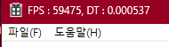

---

layout: single
title: "Win32API (5) Timer"
categories: Win32API
tag: [WIn32API, C++, Study]
toc: true
toc_sticky : true
author_profile: true
search: true
---

## < Delta Time 구하는법 >

```c++
// CTimeMgr.h
#pragma once

class CTimeMgr
{
	SINGLE(CTimeMgr); // 싱글톤 선언

private:
	LARGE_INTEGER m_llCurCount;
	LARGE_INTEGER m_IIPrevCount;
	LARGE_INTEGER m_llFrequency;

	double		  m_dDT; // 프레임 사이의 시간값
	double		  m_dAcc; // 1초 체크를 위한 누적 시간
	UINT		  m_iCallCount; // 함수 호출 횟수 체크
	UINT          m_iFPS; // 초당 호출 횟수

	// FPS 구하기
	// 1 프레임당 걸리는 시간 = Delta Time

public:
	void init();
	void update();

public:
	double GetDT() { return m_dDT; }
	float GetfDT() { return (float)m_dDT; }
};
```


```c++
// CTimeMgr.cpp
#include "pch.h"
#include "CTimeMgr.h"
#include "CCore.h"

CTimeMgr::CTimeMgr()
	: m_llCurCount{}
	, m_IIPrevCount{}
	, m_llFrequency{}
	, m_dDT(0.)
	, m_dAcc(0.)
	, m_iCallCount(0)
{

}

CTimeMgr::~CTimeMgr()
{

}

void CTimeMgr::init()
{
	// 현재 카운트
	QueryPerformanceCounter(&m_IIPrevCount);

	// 초당 카운트 횟수
	QueryPerformanceFrequency(&m_llFrequency);
}

void CTimeMgr::update() // 매 프레임마다 업데이트
{
	QueryPerformanceCounter(&m_llCurCount);

	// 이전 프레임의 카운팅과, 현재 프레임 카운팅 값의 차이를 구한다
	m_dDT = (double)(m_llCurCount.QuadPart - m_IIPrevCount.QuadPart ) / (double)m_llFrequency.QuadPart;

	// 이전 카운트 값을 현재값으로 갱신(다음번에 계산을 위해서)
	m_IIPrevCount = m_llCurCount;

	++m_iCallCount;
	m_dAcc += m_dDT; // DT 누적

	if (m_dAcc >= 1.)
	{
		m_iFPS = m_iCallCount;
		m_dAcc = 0.;
		m_iCallCount = 0;

		wchar_t szBuffer[255] = {};
		swprintf_s(szBuffer, L"FPS : %d, DT : %f", m_iFPS, m_dDT);
		SetWindowText(CCore::GetInst()->GetMainHwnd(), szBuffer);
	}
}
```

컴퓨터 마다 성능이 달라서 느린 컴퓨터나, 빠른 컴퓨터나 일정하게 물체가 움직이는 속도를 조절하기 위해서 시간 동기화가 필요하다



FPS 의 의미 : 1초당 프레임 수제

1초에 2번 실행되는 컴퓨터, 1 / FPS(프레임) = 1/2 = 0.5초 = 1FPS 당 걸리는 시간 = ( Delta Time )

1 / FPS(프레임)이 바로 Delta Time 를 의미한다


즉 총 이동량 * 한 프레임 당 걸리는 시간 = 1 FPS 당 움직일 거리를 구할수 있으므로

FPS를 구한뒤 -> Delta Time을 계산하면 된다


### QueryPerformanceCounter()

CPU에는 QueryPerformanceCounter라는 고사양의 타이머가 존재한다

타이머의 현재 CPU 클럭, Tick 수를 얻는다


### QueryPerformanceFrequency()

타이머가 동작하고 있는 주파수를 반환한다


클럭 틱 차이에 주파수를 나누면 해당하는 수행시간을 구할 수 있다
