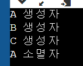
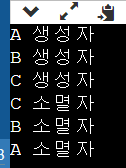

---

layout: single
title: "Win32API (8) Scene Manager"
categories: Win32API
tag: [WIn32API, C++, Study]
toc: true
toc_sticky : true
author_profile: true
search: true
---


화면 안에는 무수히 많은 오브젝트들이 존재한다

이러한 오브젝트를 일괄적으로 관리해주는 Scene이 필요하다


### < 오브젝트 분류 >

```c++
// define.h

// 씬에 존재하는 오브젝트들을 분리하는 작업
enum class GROUP_TYPE
{
	DEFAULT,
	PLAYER,
	MISSILE,
	MONSTER,

	END = 32,
};

// 다양한 종류의 씬들을 관리하기 위한 작업
enum class SCENE_TYPE
{
	TOOL,
	START,
	STAGE_01,
	STAGE_02,
	END,
};
```


```c++
// CScene.h
#pragma once

// 전방선언
class CObject;

class CScene
{
private:
	vector<CObject*> m_arrObj[(UINT)GROUP_TYPE::END]; // 오브젝트를 저장 및 관리할 벡터를 그룹 개수만큼 선언
	wstring m_strName; // Scene 이름

public:
	void SetName(const wstring& _strName)
	{
		m_strName = _strName;
	}

	const wstring& GetName()
	{
		return m_strName;
	}

	void update();
	void render(HDC _dc);

	virtual void Enter() = 0; // 해당 Scene 에 진입 시 호출
	virtual void Exit() = 0; // 해당 Scene 을 탈출 시 호출

protected:
	void AddObject(CObject* _pObj, GROUP_TYPE _eType)
	{
		m_arrObj[(UINT)_eType].push_back(_pObj);
	}

public:
	CScene();
	virtual ~CScene();
};
```


씬과 씬의 전환이 발생할때 벗어나는 씬 입장에서는 씬을 빠져나ㅏ갈때ㅐ 해주어야 할일들을 각 씬마다 다르게 구현해 줘야하기 때문에

Enter와 Exit함수를 순수 가상함수(인터페이스)로 선언했다

이 씬 클래스를 상속받은 클래스들은 Start와 Exit를 구현하지 않으면 안된다


```c++
// CScene.cpp 
#include "pch.h"
#include "CScene.h"

#include "CObject.h"

CScene::CScene()
{
}

CScene::~CScene()
{
	for (UINT i = 0; i < (UINT)GROUP_TYPE::END; ++i)
	{
		for (size_t j = 0; j < m_arrObj[i].size(); ++j)
		{
			// m_arrObj[i] 그룹 벡터의 j 물체 삭제
			delete m_arrObj[i][j];
		}
	}
}

void CScene::update()
{
	for (UINT i = 0; i < (UINT)GROUP_TYPE::END; ++i)
	{
		for (size_t j = 0; j < m_arrObj[i].size(); ++j)
		{
			m_arrObj[i][j]->update();
		}
	}
}

void CScene::render(HDC _dc)
{
	for (UINT i = 0; i < (UINT)GROUP_TYPE::END; ++i)
	{
		for (size_t j = 0; j < m_arrObj[i].size(); ++j)
		{
			m_arrObj[i][j]->render(_dc);
		}
	}
}
```


```c++
// CSceneMgr.h
#pragma once

class CScene;

class CSceneMgr
{
	SINGLE(CSceneMgr);

private:
	CScene* m_arrScene[(UINT)SCENE_TYPE::END]; // 모든 씬 목록을 저장하는 배열
	CScene* m_pCurScene; // 현재 씬을 저장하는 변수

public:
	void init();
	void update();
	void render(HDC _dc);
	
};
```


임시로 Start Scene 클래스 하나 작성 ( Scene을 상속 받음 )


```C++
// CScene.Start.h
#pragma once
#include "CScene.h"

class CScene_Start :
    public CScene
{
public:
    virtual void Enter();
    virtual void Exit();

public:
    CScene_Start();
    ~CScene_Start();
};
```


```c++
// CScene.Start.cpp
#include "pch.h"
#include "CScene_Start.h"

#include "CObject.h"

CScene_Start::CScene_Start()
{
}

CScene_Start::~CScene_Start()
{
}

void CScene_Start::Enter()
{
	// Object 추가
	CObject* pObj = new CObject;

	pObj->SetPos(Vec2(640.f,384.f));
	pObj->SetScale(Vec2(100.f, 100.f));

	AddObject(pObj, GROUP_TYPE::DEFAULT);
}

void CScene_Start::Exit()
{
}
```


```c++
// CSceneMgr.cpp

#include "pch.h"
#include "CSceneMgr.h"
#include "CScene_Start.h"

CSceneMgr::CSceneMgr()
	: m_arrScene{}
	, m_pCurScene(nullptr)
{

}

CSceneMgr::~CSceneMgr()
{
	// 씬 전부 삭제
	for (UINT i = 0; i < (UINT)SCENE_TYPE::END; ++i)
	{
		if (nullptr != m_arrScene[i])
		{
			delete m_arrScene[i];
		}
	}
}

void CSceneMgr::init()
{
	// Scene 생성
	m_arrScene[(UINT)SCENE_TYPE::START] = new CScene_Start;
	m_arrScene[(UINT)SCENE_TYPE::START]->SetName(L"Start Scene");
	// m_arrScene[(UINT)SCENE_TYPE::TOOL] = new CScene_Tool;
	// m_arrScene[(UINT)SCENE_TYPE::STAGE_01] = new CScene_Stage01;
	// m_arrScene[(UINT)SCENE_TYPE::STAGE_02] = new CScene_Stage02;


	// 현재 씬 지정
	m_pCurScene = m_arrScene[(UINT)SCENE_TYPE::START];
	m_pCurScene->Enter();
}

void CSceneMgr::update()
{
	m_pCurScene->update();
}

void CSceneMgr::render(HDC _dc)
{
	m_pCurScene->render(_dc);
}

```


씬매니저 초기화 함수 부분에서 임시 START 씬을 생성한뒤 현재씬을 START 씬으로 저장


```c++
// Core.cpp
int CCore::init(HWND _hWnd, POINT _ptResolution)
{
	m_hWnd = _hWnd;
	m_ptResolution = _ptResolution;

	// 해상도에 맞게 윈도우 크기 조정
	RECT rt = {0, 0, m_ptResolution.x, m_ptResolution.y};
	AdjustWindowRect(&rt, WS_OVERLAPPEDWINDOW, true);
	SetWindowPos(m_hWnd, nullptr, 100, 100, rt.right - rt.left, rt.bottom - rt.top, 0);

	m_hDC = GetDC(m_hWnd);
	// m_hWnd의 비트맵을 가져와 m_hDC 그리기에 목적지로 삼음

	// 이중 버퍼링 용도의 비트맵과 DC 를 만든다 ( 윈도우를 하나 더 만들면 창이 2개가 생김, 비트맵만 가져오기 )
	m_hBit = CreateCompatibleBitmap(m_hDC, m_ptResolution.x, m_ptResolution.y); // 비트맵 생성
	m_memDC = CreateCompatibleDC(m_hDC); // DC 생성

	HBITMAP hOldBit = (HBITMAP)SelectObject(m_memDC, m_hBit);  // 그림을 그릴 타겟 설정, 원래있던 1픽셀 비트맵 반환
	DeleteObject(hOldBit); // 쓸모없으므로 바로 삭제

	// Manager 초기화
	CTimeMgr::GetInst()->init();
	CKeyMgr::GetInst()->init();
	CSceneMgr::GetInst()->init();


	return S_OK;
}

void CCore::progress()
{
	// Manager Update
	CTimeMgr::GetInst()->update();
	CKeyMgr::GetInst()->update();
	CSceneMgr::GetInst()->update();

	// ==================
	// Rendering 
	// ===========
	// 화면 Clear

	Rectangle(m_memDC, -1, -1, m_ptResolution.x + 1, m_ptResolution.y + 1);
	
	CSceneMgr::GetInst()->render(m_memDC);

	BitBlt(m_hDC, 0, 0, m_ptResolution.x, m_ptResolution.y
		, m_memDC, 0, 0, SRCCOPY);
}
```

화면을 씬별로 관리하기 때문에 Core 또한 씬 매니져에 의해 update와 render가 돌아가도록 구조를 변경


### < 전체적인 구조 >

CCore의 update.render에서 CSceneMgr를 호출 -> CSceneMgr의 update, render에서 m_pCurScene(현재씬)을 호출 

-> m_pCurScene(현재씬)의 update, render에서 CObject 호출 -> CObject의 눌린 키값에 update 처리, 위치 크기 렌더


 

### C++ 상속 시 부모 클래스 소멸자에 Virtual를 사용해야 하는 이유

부모 클래스의 포인터로 자식 클래스를 호출 할때 가상 함수로 정의되지 않은 자식 클래스의 함수를 호출하면 부모 클래스의 멤버 함수가 호출된다

소멸자도 자식 클래스의 소멸자가 아닌 부모 클래스의 소멸자가 호출이 된다


가상 함수로 소멸자가 사용되었다면 자식 클래스에서 재정의 될 수 있음을 명시하기 때문에 자식 클래스의 소멸자부터 차례대로 부모 클래스의 소멸자가 호출된다

```c++
#include <iostream>

using namespace std;

class A
{
    public:
    A()
    {
        cout << "A 생성자" << endl;
    }
    ~A()
    {
        cout << "A 소멸자" << endl;
    }
};

class B : public A
{
    public:
    B()
    {
        cout << "B 생성자" << endl;
    }
    ~B()
    {
        cout << "B 생성자" << endl;
    }
};

class C : public B
{
    public:
    C()
    {
        cout << "C 생성자 " << endl;
    }
    ~C()
    {
        cout << "C 소멸자" << endl;
    }
};

int main()
{
    A* a = new C();
    delete a;

    return 0;
}
```


< virtual를 사용하지 않고 부모 클래스 포인터로 자식 클래스를 호출했을때 결과 >



```c++
#include <iostream>

using namespace std;

class A
{
    public:
    A()
    {
        cout << "A 생성자" << endl;
    }
    virtual ~A()
    {
        cout << "A 소멸자" << endl;
    }
};

class B : public A
{
    public:
    B()
    {
        cout << "B 생성자" << endl;
    }
    ~B()
    {
        cout << "B 소멸자" << endl;
    }
};

class C : public B
{
    public:
    C()
    {
        cout << "C 생성자 " << endl;
    }
    ~C()
    {
        cout << "C 소멸자" << endl;
    }
};

int main()
{
    A* a = new C();
    delete a;

    return 0;
}
```


< virtual를 붙였을때 결과값 >

