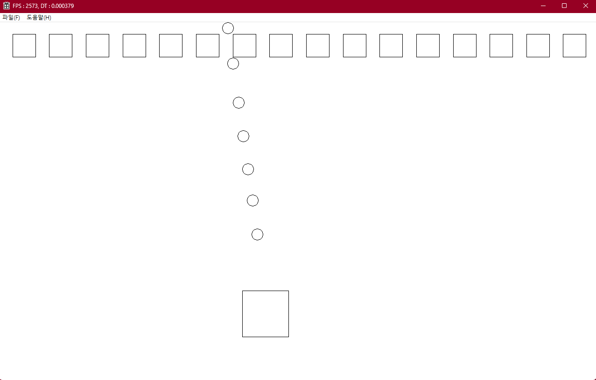

---

layout: single
title: "Win32API (9) Object"
categories: Win32API
tag: [WIn32API, C++, Study]
toc: true
toc_sticky : true
author_profile: true
search: true

---




## 플레이어 오브젝트 생성

플레이어가 조작할 CObject를 상속 받은 Cplayer 클래스 생성

```c++
// CPlayer.h
#pragma once
#include "CObject.h"
class CPlayer :
    public CObject
{
public:
    virtual void update();

private:
    void CreateMissile();
};
```


```c++
// CPlayer.cpp

#include "pch.h"
#include "CPlayer.h"

#include "CSceneMgr.h"
#include "CScene.h"
#include "CKeyMgr.h"
#include "CTimeMgr.h"

#include "CMissile.h"

void CPlayer::update()
{
	Vec2 vPos = GetPos();

	if (KEY_HOLD(KEY::W))
	{
		vPos.y -= 200.f * fDT;
	}

	if (KEY_HOLD(KEY::S))
	{
		vPos.y += 200.f * fDT;
	}

	if (KEY_HOLD(KEY::A))
	{
		vPos.x -= 200.f * fDT;
	}

	if (KEY_HOLD(KEY::D))
	{
		vPos.x += 200.f * fDT;
	}

	if (KEY_TAP(KEY::SPACE))
	{
		CreateMissile();
	}

	SetPos(vPos);
}

void CPlayer::CreateMissile()
{
	Vec2 vMissilePos = GetPos();
	vMissilePos.y -= GetScale().y / 2.f;

	CMissile* pMissile = new CMissile;

	pMissile->SetPos(vMissilePos);
	pMissile->SetScale(Vec2(25.f, 25.f));
	pMissile->SetDir(Vec2(-1.f, -7.f));

	CScene* pCurScene = CSceneMgr::GetInst()->GetCurScene();
	pCurScene->AddObject(pMissile, GROUP_TYPE::DEFAULT);

}
```


### KEY_HOLD, KEY_TAP, KEY_AWAY, KEY_NONE

더 간편하게 쓸수 있도록 define 헤더에서 매크로로 지정함

```C++
// define.h
#define KEY_CHECK(key, state) CKeyMgr::GetInst()->GetKeyState(key) == state
#define KEY_HOLD(key) KEY_CHECK(key, KEY_STATE::HOLD)
#define KEY_TAP(key) KEY_CHECK(key, KEY_STATE::TAP)
#define KEY_AWAY(key) KEY_CHECK(key, KEY_STATE::AWAY)
#define KEY_NONE(key) KEY_CHECK(key, KEY_STATE::NONE)

#define PI 3.1415926535f
```


## 플레이어가 쏘는 미사일 오브젝트 생성

```c++
// CMissile.h
#pragma once
#include "CObject.h"
class CMissile :
    public CObject
{
private:
    float     m_fTheta; // 이동 방향
    Vec2      m_vDir;


public:
    void SetDir(float _fTheta)
    {
        m_fTheta = _fTheta;
    }

    void SetDir(Vec2 _vDir)
    {
        m_vDir = _vDir;
        m_vDir.Normalize();
    }

public:
    virtual void update();
    virtual void render(HDC _dc);

public:
    CMissile();
    ~CMissile();
};
```


```c++
// CMissile.cpp
#include "pch.h"
#include "CMissile.h"

#include "CTimeMgr.h"

CMissile::CMissile()
	: m_fTheta(3.f * PI / 2.f) // 윈도우는 방향이 반대임
	, m_vDir(Vec2(1.f,1.f))
{ 
	m_vDir.Normalize();
}

CMissile::~CMissile()
{
}

void CMissile::update()
{
	Vec2 vPos = GetPos();

	vPos.x += 600.f * m_vDir.x * fDT;
	vPos.y += 600.f * m_vDir.y * fDT; 

	SetPos(vPos);

}

void CMissile::render(HDC _dc)
{
	Vec2 vPos = GetPos();
	Vec2 vScale = GetScale();

	Ellipse(_dc, (int)(vPos.x - vScale.x / 2.f), (int)(vPos.y - vScale.y / 2.f)
		, (int)(vPos.x + vScale.x / 2.f), (int)(vPos.y + vScale.y / 2.f));
}
```


원하는 각도에 미사일을 발사하기 위해서는 정규화 과정이 필요하다

( 정규화를 거치지 않고 x,y 값으로 업데이트 하게 되면 빗변의 길이가 길어짐 )


빗변의 길이를 1로 만들어서 그 비율에 맞는 x값과 y값을 업데이트하면 된다

정규화 하는 과정은 Vec2 구조체 안에서 구현했다


```c++
// struct.h
struct Vec2
{
	float x;
	float y;

public:
	float Length()
	{
		return sqrt(x* x + y * y);
	}

	Vec2& Normalize()
	{
		float fLen = Length();

		assert(fLen != 0.f);

		x /= fLen;
		y /= fLen;

		return *this;
	}
}
```


참고 ) 추상 클래스는 동작이 정의되지 않은 순수 가상 함수를 포함하고 있으므로, 인스턴스를 생성할수 없다


## 몬스터 오브젝트 생성

```c++
// CMonster.h
#pragma once
#include "CObject.h"

class CMonster :
    public CObject
{
private:
    Vec2    m_vCenterPos;
    float   m_fSpeed;
    float   m_fMaxDistance;
    int     m_iDir; // 1, -1

public:
    float GetSpeed() { return m_fSpeed; }
    void SetSpeed(float _f) { m_fSpeed = _f; }
    void SetMoveDistance(float _f) { m_fMaxDistance = _f; }
    void SetCenterPos(Vec2 _vPos) { m_vCenterPos = _vPos; }

public:
    virtual void update();

public:
    CMonster();
    ~CMonster();
};
```


```c++
// CMonster.cpp
#include "pch.h"
#include "CMonster.h"

#include "CTimeMgr.h"

CMonster::CMonster()
	: m_vCenterPos(Vec2(0.f,0.f))
	, m_fSpeed(100.f)
	, m_fMaxDistance(50.f)
	, m_iDir(1)
{
}

CMonster::~CMonster()
{
}

void CMonster::update()
{
	Vec2 vCurPos = GetPos();

	// 진행 방향으로 시간당 m_fSpeed 만큼 이동
	vCurPos.x += fDT * m_fSpeed * m_iDir;
	
	// 배회 거리 기준량을 넘어섰는지 확인
	float fDist = m_fMaxDistance < abs(m_vCenterPos.x - vCurPos.x);
	if (0.f < fDist)
	{
		// 초과한 양
		m_iDir *= -1;
		vCurPos.x += fDist * m_iDir;

	}

	SetPos(vCurPos);
}
```


몬스터는 정해진 해상도 안에서만 움직이게 구현했다

물론 씬에서 등장해야하기 때문에 현재 씬인 CScene_Start.cpp에서도 몬스터를 배치해야함


```c++
#include "pch.h"
#include "CScene_Start.h"

#include "CObject.h"
#include "CPlayer.h"
#include "CMonster.h"

#include "CCore.h"

CScene_Start::CScene_Start()
{
}

CScene_Start::~CScene_Start()
{
}

void CScene_Start::Enter()
{
	// Object 추가
	CObject* pObj = new CPlayer;

	pObj->SetPos(Vec2(640.f,384.f));
	pObj->SetScale(Vec2(100.f, 100.f));

	AddObject(pObj, GROUP_TYPE::DEFAULT);

	// 몬스터 배치
	int iMonCount = 16;
	float fMoveDist = 25.f;
	float fObjScale = 50.f;

	Vec2 vResolution = CCore::GetInst()->GetResolution();
	CMonster* pMonsterObj = nullptr;

	float fTerm = (vResolution.x - ((fMoveDist + fObjScale / 2.f) * 2)) / (float)(iMonCount - 1);

	for (int i = 0; i < iMonCount; ++i)
	{
		// Monster Object 추가
		CMonster* pMonsterObj = new CMonster;
		pMonsterObj->SetPos(Vec2((fMoveDist + fObjScale / 2.f) + fTerm * (float)i, 50.f));
		pMonsterObj->SetScale(Vec2(fObjScale, fObjScale));
		pMonsterObj->SetCenterPos(pMonsterObj->GetPos());
		pMonsterObj->SetMoveDistance(fMoveDist);
		AddObject(pMonsterObj, GROUP_TYPE::DEFAULT);
	}
}

void CScene_Start::Exit()
{
}
```